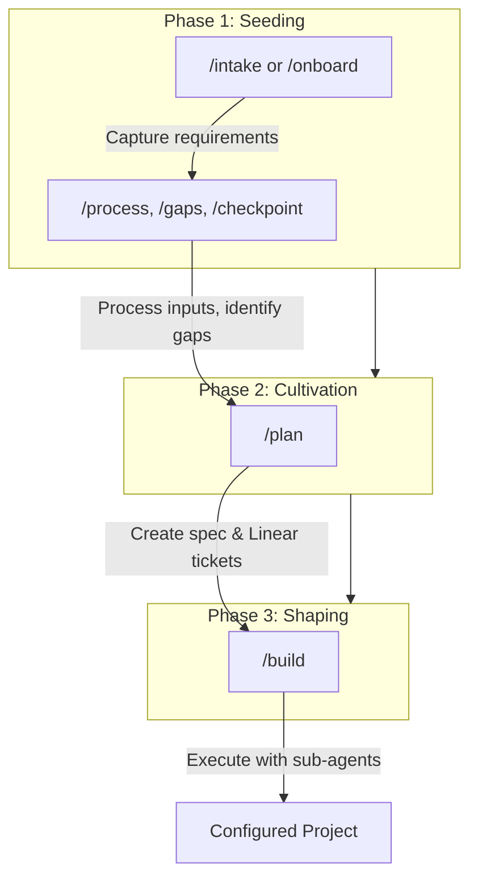

# Project Creator

**The challenge:** Setting up a Claude Code project well requires capturing tacit knowledge — requirements, constraints, architectural decisions, workflow patterns — that lives in your head. Without systematic extraction, projects start incomplete, context gets lost, and teams can't scale what individuals discover.

**The solution:** Project Creator uses reverse prompting to draw out your knowledge through structured conversation, then generates the Claude Code configuration artifacts: `CLAUDE.md`, `README.md`, skills, commands, and agents. You seed requirements, cultivate them into an implementation plan, then shape the final project — transforming ad-hoc setup into repeatable, scalable project creation.

---

## Prerequisites

### Required

- **Claude Code** — This project is designed to run inside Claude Code
- **Linear MCP** — The `/plan` and `/build` commands create and read tickets from Linear

### Linear Setup

Project Creator uses [Linear](https://linear.app) as the external memory for implementation plans. The Cultivation and Shaping phases require Linear MCP to be configured.

1. Install the Linear MCP server in your Claude Code configuration
2. Authenticate with your Linear workspace
3. Create a Linear project for tracking Project Creator work (or use an existing one)

Without Linear, you can still use the Seeding phase commands (`/intake`, `/onboard`, `/process`, `/gaps`, `/checkpoint`), but `/plan` and `/build` will not function.

---

## Workflow Overview



---

## Typical Workflow

```bash
# 1. Create or set project
/project new client/project-name

# 2. Seed: Capture requirements
/intake                    # Interactive requirements gathering
/intake product-manager    # ...or use a project type for accelerated intake
/process                   # Feed in existing documents
/gaps                      # Check what's missing

# 3. Cultivate: Plan the build
/plan                      # Creates spec + Linear tickets
# Review tickets in Linear, approve when ready

# 4. Shape: Build the project
/build                     # Executes tickets with sub-agents
```

---

## Quick Start (for usage within Claude Code)

### Starting a New Project

```bash
# Point Claude Code at this directory
cd project-creator

# Create a new project
/project new acme-corp/api-service

# Start the intake conversation
/intake                         # General intake
/intake product-manager         # Or specify a project type (see below)

# (Answer questions as Claude draws out your requirements)

# Check what's still needed
/gaps

# End your session
/checkpoint
```

### Onboarding an Existing Project

```bash
# Clone your existing project into projects/
git clone <repo-url> projects/acme-corp/existing-api

# Set it as current
/project acme-corp/existing-api

# Analyze and fill gaps
/onboard
```

### Continuing Work

```bash
# Set your project
/project acme-corp/api-service

# See where you left off
/gaps

# Continue capturing
/intake

# End session
/checkpoint
```

---

## Quick Start (for usage within a Claude Cowork task)

Claude Cowork tasks run in a separate environment where Claude doesn't automatically read your project configuration. You need to explicitly tell it to orient itself first.

### Setting Up

1. When creating a Cowork task, click the button to set working folders
2. Set the working folder to your `project-creator` directory

### Starting a Project

Your first message should tell Claude to orient itself as the project creator. Without this, Claude won't know about the local commands, agents, and skills — and will make up its own versions when you reference them later.

**Example opening prompt:**

> We're going to be creating another writing companion project. First, let's make sure you've set yourself up as the project creator. Look at the `CLAUDE.md` in this working directory and make sure you understand it. Then look in the `.claude` folder so you see the local commands, agents, and skills available for you to use.

The key elements are:
- **State what you're doing** — Give Claude the high-level goal
- **Direct it to read `CLAUDE.md`** — This is the project configuration that defines how Project Creator works
- **Direct it to read the `.claude` folder** — This is where commands (`/intake`, `/plan`, `/build`, etc.), agents, and skills live

After Claude confirms it has oriented itself, you can use commands normally.

**Example follow-up prompt (creating a project):**

> Run the `/project` command to create a new project in `consortium.team` and call it `writing-companion-sonjaya`.

**Example follow-up prompt (providing context before intake):**

> Now to give you a little context before we do the intake command. The very first writing companion we created was called `the-sorrow`. Then I met with a friend who was interested in testing the experience, so we created `writing-companion-[friend name]` for him. We also thought about productizing the experience, which is what `writing-companion-pm` is about — but you can ignore that one for this project since it's about productization rather than creating a new writing companion for a specific person.
>
> Even though I have the writing companion called `the-sorrow`, that was my first take at it. I want to re-intake myself where we can use `the-sorrow` as context, but apply the learnings from when we created `writing-companion-[friend name]` and the learnings from abstracting that into the writing companion project type.
>
> Please run the command: `/intake writing-companion`

This example shows an important pattern: **give Claude the lay of the land before running a command**. By explaining which prior projects exist, how they relate, and what you want to carry forward vs. ignore, you get a much more informed intake conversation.

**Example follow-up prompt (checking progress):**

> Run the `/gaps` command and see how we're doing.

**Example follow-up prompt (running the plan):**

> Please run the `/plan` command. I'm not saying do the things that you think the plan should do — actually run the command so that we're following the disciplined steps that it takes.

Note the explicit instruction to run the command rather than improvise. In Cowork tasks, Claude sometimes interprets a request like "plan this" as permission to do what it thinks planning means, rather than executing the `/plan` command with its defined steps. Being direct about this avoids skipped steps.

**Running the build:**

At this point you can switch to Claude Code to run `/build`, which tends to work more reliably for the build phase. If you prefer to stay in Cowork, use the same explicit form:

> Please run the `/build` command. I'm not saying do the things that you think the build should do — actually run the command so that we're following the disciplined steps that it takes.

---

## The Three Phases

Project creation happens in phases:

| Phase | Focus | Commands |
|-------|-------|----------|
| **Seeding** | Capture requirements and context | `/intake`, `/onboard`, `/process`, `/gaps`, `/checkpoint` |
| **Cultivation** | Create implementation plan | `/plan` |
| **Shaping** | Execute plan with sub-agents | `/build` |

### Phase 1: Seeding

Capture enough context that a well-configured Claude Code project can be generated.

| Command | Purpose |
|---------|---------|
| `/intake` | New project reverse prompting |
| `/onboard` | Existing project analysis |
| `/process` | Handle external inputs (transcripts, docs) |
| `/gaps` | Assessment checkpoint |
| `/checkpoint` | Session capture |

### Phase 2: Cultivation

Consolidate requirements into an actionable implementation plan.

| Command | Purpose |
|---------|---------|
| `/plan` | Create implementation spec and Linear tickets |

`/plan` does the following:
- Creates implementation spec from captured requirements
- Creates Linear tickets with proper dependencies
- Creates structured `tickets.yaml` for build automation
- Requires user approval before proceeding to build

### Phase 3: Shaping

Execute the implementation plan with specialized sub-agents.

| Command | Purpose |
|---------|---------|
| `/build` | Execute implementation plan |

`/build` does the following:
- Reads tickets from `tickets.yaml`
- Uses `ticket-executor` agent (Opus) to implement each ticket
- Uses `ticket-verifier` agent (Sonnet) to verify completion
- Tracks progress in `build-progress.md`
- Recovers from interruptions automatically

---

## Agent Architecture

During `/build`, work is executed by specialized sub-agents:

| Agent | Role | Model |
|-------|------|-------|
| `ticket-executor` | Implements each ticket | Opus |
| `ticket-verifier` | Verifies completion independently | Sonnet |

This separation ensures:
- Fresh context per ticket (no degradation)
- Independent verification (no self-confirmation bias)
- Cost efficiency (Sonnet for verification)
- Clear failure attribution

---

## Commands Reference

### `/project` — Manage Project Context

| Usage | What It Does |
|-------|--------------|
| `/project` | Show current project and list all projects |
| `/project client/name` | Set current project (must exist) |
| `/project new client/name` | Create new project and set as current |

**Examples:**
```
/project                                    # What am I working on?
/project acme-corp/web-app                  # Switch to this project
/project new startup-inc/api-refactor       # Start a new project
```

### `/intake` — New Project Reverse Prompting

Starts a guided conversation to capture project requirements. Claude asks questions one at a time about:

- **Purpose** — What problem does this solve?
- **Users** — Who will use this?
- **Success criteria** — How will we know it works?
- **Constraints** — Technical, time, organizational limits
- **Context** — Related systems, prior art

Captured information is written to `[project]/context/` files.

**Project Type Acceleration:**

You can specify a project type to accelerate intake with type-specific questions, proven directory structures, and reference implementations:

```
/intake product-manager         # Use a known project type
/intake                         # General intake (no type)
```

When a type is specified, Claude loads the type's intake guide, typical structure, and reference projects — giving you a head start based on what's worked before.

**Available Public Project Types:**

| Type | Description | Use When |
|------|-------------|----------|
| `product-manager` | PM thinking partner for product strategy and discovery | You have a product idea and need a critical, creative PM to help discover strategy, write specs, and create implementation tickets |

Private project types may also be available in `project-types/private/`. Run `/intake` without a type to see all available options.

### `/onboard` — Existing Project Analysis

For projects that already exist. Claude:

1. Analyzes what's there (CLAUDE.md, README, commands, etc.)
2. Reports what's FOUND vs MISSING
3. Asks before filling gaps
4. Uses reverse prompting to capture what's missing

**Prerequisite:** Clone/copy the project into `projects/[client]/[name]/` first.

### `/process` — Handle External Inputs

Feed in transcripts, documents, or notes. Claude extracts:

- Requirements mentioned
- Constraints identified
- Decisions implied
- Questions raised

Updates project context files with structured information.

**Usage:**
```
/process
(paste your transcript or notes)

/process path/to/document.md
```

### `/gaps` — Assessment

Checks captured context against what's needed for a complete project:

- Is the purpose clear?
- Are users identified?
- Are success criteria defined?
- Are constraints captured?
- Are key decisions documented?

Reports gaps with priorities and suggests what to capture next.

### `/checkpoint` — Session Capture

Run before ending a session. Claude:

1. Summarizes what was captured
2. Updates tracking files
3. Notes patterns discovered
4. Identifies next steps
5. Prepares handoff notes

### `/plan` — Create Implementation Plan

Consolidates seeding phase outputs into an actionable plan:

1. Reviews all context files (requirements, constraints, decisions)
2. Creates implementation specification
3. Generates Linear tickets with dependencies
4. Creates `tickets.yaml` for build automation
5. Presents plan for user approval

**Prerequisite:** Complete seeding phase first. Run `/gaps` to verify readiness.

### `/build` — Execute Implementation Plan

Executes the approved plan using sub-agents:

1. Reads tickets from `tickets.yaml`
2. For each ticket in dependency order:
   - Spawns `ticket-executor` (Opus) to implement
   - Spawns `ticket-verifier` (Sonnet) to verify
   - Updates `build-progress.md`
3. Handles failures with clear attribution
4. Recovers from interruptions automatically
5. If a project type was used, updates the type's `reference-projects.md` with this project as a new reference

**Prerequisite:** Run `/plan` first and approve the generated tickets.

---

## Directory Structure

```
project-creator/
├── CLAUDE.md                    # Configuration for Claude
├── README.md                    # This file
├── methodology.md               # Deep reference on reverse prompting
├── tracking/
│   ├── current-project.md       # Which project is active
│   ├── projects-log.md          # Registry of all projects
│   └── patterns-discovered.md   # Learnings for future use
├── project-types/               # Codified project types (accelerators)
│   ├── public/                  # Open source types (committed to repo)
│   │   └── product-manager/     # PM thinking partner for product strategy
│   └── private/                 # Proprietary types (git-ignored)
├── .claude/
│   ├── commands/
│   │   ├── project.md
│   │   ├── intake.md
│   │   ├── onboard.md
│   │   ├── process.md
│   │   ├── gaps.md
│   │   ├── checkpoint.md
│   │   ├── plan.md              # Cultivation phase
│   │   └── build.md             # Shaping phase
│   └── agents/
│       ├── ticket-executor.md
│       └── ticket-verifier.md
├── templates/                   # Project templates (emerges over time)
├── docs/                        # Planning documents
└── projects/                    # Sub-projects (git-ignored)
    └── [client]/
        └── [project]/           # Each has its own git repo
```

### Sub-Project Structure

When you create a project, it gets:

```
projects/client/project/
├── .git/               # Independent git repo
└── context/
    ├── requirements.md # Captured requirements
    ├── constraints.md  # Technical and business constraints
    └── decisions.md    # Decisions made during intake
```

After `/plan`, the project also has:

```
projects/client/project/
├── implementation-spec.md  # Detailed implementation specification
└── tickets.yaml            # Structured tickets for /build
```

After `/build`, the project has full Claude Code configuration:

```
projects/client/project/
├── CLAUDE.md           # Project instructions
├── README.md           # Documentation
├── build-progress.md   # Build execution log
└── .claude/
    └── commands/       # Project-specific commands
```

---

## When to Use What

| Situation | Command |
|-----------|---------|
| Starting fresh with an idea | `/project new` then `/intake` |
| Starting a known project type (e.g., PM) | `/project new` then `/intake product-manager` |
| Have an existing codebase | Clone it, then `/onboard` |
| Have meeting notes or transcripts | `/process` |
| Want to see what's missing | `/gaps` |
| Ending a work session | `/checkpoint` |
| Switching between projects | `/project client/name` |
| Ready to plan implementation | `/plan` |
| Plan approved, ready to build | `/build` |

---

## Tips

1. **Answer naturally** — Don't try to structure your answers. Claude will extract and organize.

2. **It's okay to not know** — "I'm not sure yet" is a valid answer. It helps identify gaps.

3. **Use `/process` liberally** — Meeting transcripts, slack conversations, existing docs — feed them in.

4. **Run `/gaps` often** — It shows you where you are and what's next.

5. **Always `/checkpoint`** — Context can be lost. Checkpoints preserve progress.

6. **Projects evolve** — The first pass won't be perfect. That's expected.

7. **Review before `/build`** — Check the Linear tickets created by `/plan` before executing.

8. **`/build` is resumable** — If interrupted, just run `/build` again to continue where you left off.

9. **Use project types when they fit** — Running `/intake product-manager` is faster than starting from scratch.

---

## Project Types

Project types are codified patterns that accelerate intake. When you've built a particular kind of project enough times, the patterns get extracted into a type with specialized intake questions, proven directory structures, and reference implementations.

### Available Public Types

| Type | What It Creates | Key Pattern |
|------|----------------|-------------|
| **`product-manager`** | A PM thinking partner Claude project | Strategy-as-anchor: product hypothesis as decision lens, reverse prompting for discovery, three-phase methodology (Seeding → Cultivation → Shaping) |

Use a type by passing it to `/intake`:

```bash
/project new my-company/my-product-pm
/intake product-manager
```

### Type Structure

Each type contains 5 files:

| File | Purpose |
|------|---------|
| `TYPE.md` | What this type is, when to use it, what varies vs. what's universal |
| `intake-guide.md` | Type-specific intake questions (loaded automatically by `/intake`) |
| `typical-structure.md` | Directory layout that works for this type |
| `typical-commands.md` | Commands this type usually has |
| `reference-projects.md` | Successful implementations to learn from |

### Creating New Types

Project types emerge from successful projects. When a project pattern has been used 2+ times and the patterns are clear, extract it:

1. Create `project-types/public/[type-name]/` (or `private/` for proprietary types)
2. Write all 5 type files following the structure above
3. Add the first reference project
4. Test it by running `/intake [type-name]` for a new project

Private types live in `project-types/private/` and are git-ignored.

### A Note on Reference Projects

Each type includes a `reference-projects.md` that documents successful implementations — configuration choices, key decisions, what worked, files worth studying. These are enormously helpful for accelerating future projects of the same type.

However, reference projects point to actual project paths in your `projects/` directory, which is private and git-ignored. So `reference-projects.md` is also git-ignored for public types — it wouldn't be useful to someone who doesn't have your projects.

**The good news:** `/build` automatically updates `reference-projects.md` after completing a build for any project that was created from a type. You don't need to do anything — each successful build adds itself as a reference for the next project of that type.

When you clone this repo or start using a public type for the first time, you won't have a `reference-projects.md` yet. That's fine — the type works without it. Your first `/build` will create it.
