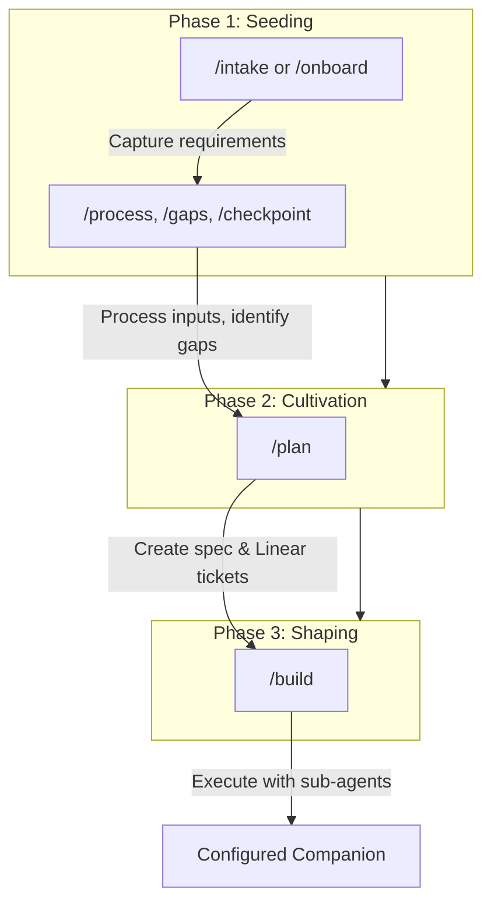
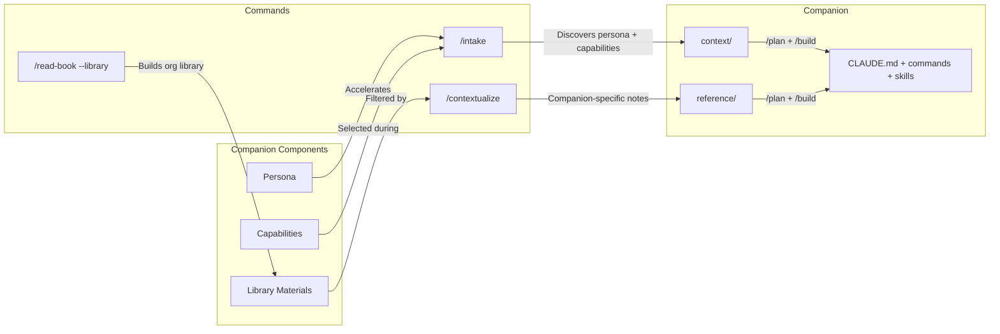

# Project Creator

**The challenge:** Creating an effective AI companion requires capturing tacit knowledge — requirements, constraints, architectural decisions, workflow patterns — that lives in your head. Without systematic extraction, companions start incomplete, context gets lost, and teams can't scale what individuals discover.

**The solution:** Project Creator creates AI companions — Claude Code projects composed from reusable personas, capabilities, and domain knowledge. It uses reverse prompting to draw out your requirements through structured conversation, then generates the Claude Code configuration artifacts: `CLAUDE.md`, `README.md`, skills, commands, and agents. You seed requirements, cultivate them into an implementation plan, then shape the final companion — transforming ad-hoc setup into repeatable, scalable companion creation.

---

## Prerequisites

### Required

- **Git & GitHub** — You'll need Git installed and GitHub configured to use Project Creator. **New to Git?** See our [Getting Up to Speed on GitHub](docs/guides/getting-up-to-speed-on-github/) guide (2-3 hours for setup; includes quick-start option).
- **Clone this repository** — Clone (or fork and clone) the project-creator repo to a local directory
- **Claude Code** — This project is designed to run inside Claude Code or a Claude cowork task.
- **Linear MCP** — The `/plan` and `/build` commands create and read tickets from Linear. See [Linear's MCP setup guide](https://linear.app/docs/mcp) for configuration instructions.
- **First-time setup** — Run `/configure` after cloning to set your default organization and verify your environment is ready.

### Linear Setup

Project Creator uses [Linear](https://linear.app) as the external memory for implementation plans. The Cultivation and Shaping phases require Linear MCP to be configured.

1. Install the Linear MCP server in your Claude Code configuration (see [Linear MCP docs](https://linear.app/docs/mcp))
2. Authenticate with your Linear workspace
3. Create a Linear project for tracking Project Creator work (or use an existing one)

Without Linear, you can still use the Seeding phase commands (`/intake`, `/onboard`, `/process`, `/gaps`, `/checkpoint`), but `/plan` and `/build` will not function.

### Nice to Have

- **[Granola.ai](https://granola.ai)** — AI meeting notes tool. With the Granola MCP configured, you can feed meeting transcripts directly into Project Creator using prompts like `/process the Granola transcript from yesterday with [client name]`. Not required, but useful if your companion requirements live in meeting conversations. See [Granola MCP setup instructions](https://docs.granola.ai/help-center/sharing/integrations/mcp#claude-code).

---

## Quick Start (for usage within a Claude Cowork task)

We recommend using a Claude Cowork task for the Seeding and Cultivation phases (`/intake`, `/process`, `/gaps`, `/plan`), then switching to Claude Code for the Shaping phase (`/build`). Cowork's conversational interface is well-suited for the back-and-forth of requirements gathering and planning, while Claude Code's tool access makes it more reliable for build execution.

Cowork tasks run in a separate environment where Claude doesn't automatically read your project configuration. You need to explicitly tell it to orient itself first.

### Setting Up

1. When creating a Cowork task, click the button to set working folders
2. Set the working folder to your `project-creator` directory

### Starting a Companion

Your first message should tell Claude to orient itself as the project creator. Without this, Claude won't know about the local commands, agents, and skills — and will make up its own versions when you reference them later.

**Example opening prompt:**

> We're going to be creating another writing companion project. First, let's make sure you've set yourself up as the project creator. Look at the `CLAUDE.md` in this working directory and make sure you understand it. Then look in the `.claude` folder so you see the local commands, agents, and skills available for you to use.

The key elements are:
- **State what you're doing** — Give Claude the high-level goal
- **Direct it to read `CLAUDE.md`** — This is the project configuration that defines how Project Creator works
- **Direct it to read the `.claude` folder** — This is where commands (`/intake`, `/plan`, `/build`, etc.), agents, and skills live

After Claude confirms it has oriented itself, you can use commands normally.

**Example follow-up prompt (creating a companion):**

> Run the `/companion` command to create a new companion in `consortium.team` and call it `writing-companion-sonjaya`.

**Example follow-up prompt (providing context before intake):**

> Now to give you a little context before we do the intake command. The very first writing companion we created was called `the-sorrow`. Then I met with a friend who was interested in testing the experience, so we created `writing-companion-[friend name]` for him. We also thought about productizing the experience, which is what `writing-companion-pm` is about — but you can ignore that one for this project since it's about productization rather than creating a new writing companion for a specific person.
>
> Even though I have the writing companion called `the-sorrow`, that was my first take at it. I want to re-intake myself where we can use `the-sorrow` as context, but apply the learnings from when we created `writing-companion-[friend name]` and the learnings from abstracting that into the writing companion project type.
>
> Please run the command: `/intake writing-companion`

This example shows an important pattern: **give Claude the lay of the land before running a command**. By explaining which prior companions exist, how they relate, and what you want to carry forward vs. ignore, you get a much more informed intake conversation.

**Example follow-up prompt (checking progress):**

> Run the `/gaps` command and see how we're doing.

**Example follow-up prompt (running the plan):**

> Please run the `/plan` command. I'm not saying do the things that you think the plan should do — actually run the command so that we're following the disciplined steps that it takes.

Note the explicit instruction to run the command rather than improvise. In Cowork tasks, Claude sometimes interprets a request like "plan this" as permission to do what it thinks planning means, rather than executing the `/plan` command with its defined steps. Being direct about this avoids skipped steps.

**Running the build:**

At this point, switch to Claude Code to run `/build` — it's more reliable for the build phase. If you prefer to stay in Cowork, use the same explicit form:

> Please run the `/build` command. I'm not saying do the things that you think the build should do — actually run the command so that we're following the disciplined steps that it takes.

---

## Quick Start (for usage within Claude Code)

### Starting a New Companion

```bash
# Point Claude Code at this directory
cd project-creator
> claude [HIT ENTER]

# First time using
/configure 

# Create a new companion
/companion new acme-corp/api-service

# Start the intake conversation
/intake                         # General intake
/intake product-manager         # Or specify a persona (see below)

# (Answer questions as Claude draws out your requirements)

# Check what's still needed
/gaps

# End your session
/checkpoint
```

### Onboarding an Existing Companion

```bash
# Clone your existing companion into companions/
git clone <repo-url> companions/acme-corp/existing-api

# Set it as current
/companion acme-corp/existing-api

# Analyze and fill gaps
/onboard
```

### Continuing Work

```bash
# Set your companion
/companion acme-corp/api-service

# See where you left off
/gaps

# Continue capturing
/intake

# End session
/checkpoint
```

---

## Workflow Overview



---

## Typical Workflow

```bash
# 1. Create or set companion
/companion new client/companion-name

# 2. Seed: Capture requirements
/intake                    # Interactive requirements gathering
/intake product-manager    # ...or use a persona for accelerated intake
/process                   # Feed in existing documents
/gaps                      # Check what's missing

# 3. Cultivate: Plan the build
/plan                      # Creates spec + Linear tickets
# Review tickets in Linear, approve when ready

# 4. Shape: Build the companion
/build                     # Executes tickets with sub-agents
```

---

## The Three Phases

Companion creation happens in phases:

| Phase | Focus | Commands |
|-------|-------|----------|
| **Setup** | First-time configuration | `/configure` |
| **Seeding** | Capture requirements and context | `/companion`, `/intake`, `/onboard`, `/process`, `/gaps`, `/checkpoint`, `/read-book`, `/contextualize` |
| **Cultivation** | Create implementation plan | `/plan` |
| **Shaping** | Execute plan with sub-agents | `/build` |

### Phase 1: Seeding

Capture enough context that a well-configured Claude Code project can be generated.

| Command | Purpose |
|---------|---------|
| `/intake` | New companion reverse prompting |
| `/onboard` | Existing companion analysis |
| `/process` | Handle external inputs (transcripts, docs) |
| `/gaps` | Assessment checkpoint |
| `/checkpoint` | Session capture |
| `/read-book` | Read and annotate a book via Kindle Cloud Reader |
| `/contextualize` | Generate companion-specific reference from library notes |

### Phase 2: Cultivation

Consolidate requirements into an actionable implementation plan.

| Command | Purpose |
|---------|---------|
| `/plan` | Create implementation spec and Linear tickets |

`/plan` does the following:
- Creates implementation spec from captured requirements
- Creates Linear tickets with proper dependencies
- Creates structured `tickets.yaml` for build automation
- Requires user approval before proceeding to build

### Phase 3: Shaping

Execute the implementation plan with specialized sub-agents.

| Command | Purpose |
|---------|---------|
| `/build` | Execute implementation plan |

`/build` does the following:
- Reads tickets from `tickets.yaml`
- Uses `ticket-executor` agent (Opus) to implement each ticket
- Uses `ticket-verifier` agent (Sonnet) to verify completion
- Tracks progress in `build-progress.md`
- Recovers from interruptions automatically

---

## Advanced Guide

### Companion Architecture

Project Creator builds **companions** — Claude Code projects composed from reusable components. Each companion is assembled from a **persona** (the "who"), **capabilities** (the "what"), and optionally **library materials** (domain knowledge from books).

```
companion-kits/
├── public-kits/                 ← Shared across all orgs (committed to repo)
│   ├── personas/                ← The "who" of a companion
│   │   ├── product-manager/
│   │   ├── software-developer/
│   │   └── game-designer/
│   └── capabilities/            ← The "what" a companion can do
│       ├── reverse-prompting/
│       ├── context-ecosystem/
│       ├── strategic-planning/
│       ├── meeting-processing/
│       ├── insight-feedback-loop/
│       ├── mentor-framework/
│       ├── session-hygiene/
│       ├── craft-assessment/
│       ├── process-evolution/
│       └── knowledge-zones/
└── private-kits/                ← Org-specific (git-ignored)
    └── [org]-companion-kit/
        ├── personas/
        ├── capabilities/
        └── library/             ← Book notes organized by subject
            └── [subject]/
                └── [book]/
                    ├── notes.md
                    ├── synthesis.md
                    └── metadata.yaml
```

**How components flow into a companion:**



### The Library and Book Pipeline

The library system has two layers for getting book knowledge into a companion:

**Layer 1: Build the library** — `/read-book --library [org]` reads a book through Kindle Cloud Reader and produces comprehensive, companion-neutral notes stored in the org's library. These notes capture everything notable without filtering for any specific companion's needs. The library entry includes `notes.md` (detailed page-by-page notes), `synthesis.md` (key ideas distilled for discovery), and `metadata.yaml` (subject tags, related personas).

**Layer 2: Contextualize for a companion** — `/contextualize` takes existing library notes and generates a companion-specific reference file. It reads the full `notes.md` chapter by chapter, decides what's relevant for this particular companion, rewrites those concepts with companion-specific applicability, and records what was filtered out. The output goes to `[companion]/reference/`.

**Direct reading** — `/read-book` (without `--library`) reads a book directly for a specific companion, producing companion-specific notes in one pass. Use this when you don't need the book in the org library.

**When to use which:**

| Situation | Approach |
|-----------|----------|
| Book is useful to multiple companions | `/read-book --library` then `/contextualize` per companion |
| Book is only for one companion | `/read-book` (companion mode) |
| Library entry already exists | `/contextualize` (no re-reading needed) |

### Committing Your Work

Each companion in `companions/` has its own independent git repository, separate from project-creator's repo. After `/build` completes (or at any point during seeding):

```bash
# Navigate to the companion
cd companions/acme-corp/api-service

# Standard git workflow
git add .
git commit -m "Initial companion build from project-creator"
git remote add origin <your-repo-url>
git push -u origin main
```

Project-creator itself tracks its own changes separately. Changes to companion-kits, commands, or tracking files are committed in the project-creator repo, not in companion repos.

---

## Agent Architecture

During `/build`, work is executed by specialized sub-agents:

| Agent | Role | Model |
|-------|------|-------|
| `ticket-executor` | Implements each ticket | Opus |
| `ticket-verifier` | Verifies completion independently | Sonnet |

This separation ensures:
- Fresh context per ticket (no degradation)
- Independent verification (no self-confirmation bias)
- Cost efficiency (Sonnet for verification)
- Clear failure attribution

---

## Commands Reference

### `/companion` — Manage Companion Context

| Usage | What It Does |
|-------|--------------|
| `/companion` | Show current companion and list all companions |
| `/companion client/name` | Set current companion (must exist) |
| `/companion new client/name` | Create new companion and set as current |

**Examples:**
```
/companion                                  # What am I working on?
/companion acme-corp/web-app                # Switch to this companion
/companion new startup-inc/api-refactor     # Start a new companion
```

### `/configure` — First-Time Setup

Sets up your Project Creator environment: default organization, Linear workspace verification, and directory structure validation. Run this once after cloning the repo.

**Examples:**
```
/configure                                  # Interactive first-time setup
```

### `/intake` — New Companion Reverse Prompting

Starts a guided conversation to capture companion requirements. Claude asks questions one at a time to draw out what's in your head.

| Usage | What It Does |
|-------|--------------|
| `/intake` | Discover persona through conversation, uses current companion |
| `/intake [persona]` | Start with a known persona for current companion |
| `/intake [persona] [client/companion]` | Specify both persona and companion |

**Examples:**
```
/intake                                  # General intake — conversation discovers the persona
/intake product-manager                  # Accelerate with PM-specific questions
/intake software-developer               # Accelerate with dev-specific questions
/intake product-manager acme/app         # Specify persona and companion
```

Covers: **Purpose**, **Users**, **Success criteria**, **Constraints**, **Context**, and **The Quality** (what makes this companion distinct). Captured information is written to `[companion]/context/` files.

**Persona Acceleration:**

You can specify a persona to accelerate intake with persona-specific questions, proven directory structures, and reference implementations. When specified, Claude loads the persona's intake guide, typical capabilities, and reference projects — giving you a head start based on what's worked before.

**Available Public Personas:**

| Persona | Description |
|---------|-------------|
| `product-manager` | PM thinking partner for product strategy and discovery |
| `software-developer` | Document-driven AI code generation with developer engagement at planning and review |
| `game-designer` | Framework-heavy game design analysis |

Private personas may also exist in `companion-kits/private-kits/[org]-companion-kit/personas/`. Run `/intake` without a persona to discover which fits through conversation.

### `/onboard` — Existing Companion Analysis

For companions that already exist. Analyzes what's there and fills gaps through reverse prompting.

| Usage | What It Does |
|-------|--------------|
| `/onboard` | Analyze current companion |
| `/onboard [client/companion]` | Analyze a specific companion |

**Examples:**
```
/onboard                                 # Analyze current companion
/onboard acme-corp/existing-api          # Analyze a specific companion
```

Claude analyzes existing files (CLAUDE.md, README, commands, etc.), reports what's FOUND vs MISSING, asks before filling gaps, and uses reverse prompting to capture what's missing.

**Prerequisite:** Clone/copy the companion into `companions/[client]/[name]/` first.

### `/process` — Handle External Inputs

Feed in transcripts, documents, or notes. Claude extracts requirements, constraints, decisions, and questions, then updates companion context files.

| Usage | What It Does |
|-------|--------------|
| `/process` | Prompts for input, uses current companion |
| `/process [client/companion]` | Override companion, then prompts for input |

**Examples:**
```
/process                                 # Then paste text or give a file path
/process acme-corp/api-service           # Override companion, then paste input
```

After invoking, paste text directly or provide a file path when prompted.

### `/gaps` — Assessment

Checks captured context against what's needed for a complete companion definition. Reports gaps with priorities and suggests what to capture next.

| Usage | What It Does |
|-------|--------------|
| `/gaps` | Assess current companion |
| `/gaps [client/companion]` | Assess a specific companion |

**Examples:**
```
/gaps                                    # How complete is the current companion?
/gaps acme-corp/api-service              # Check a specific companion
```

### `/checkpoint` — Session Capture

Run before ending a session to preserve progress across context boundaries.

| Usage | What It Does |
|-------|--------------|
| `/checkpoint` | Capture state for current companion |
| `/checkpoint [client/companion]` | Capture state for a specific companion |

**Examples:**
```
/checkpoint                              # Save before ending session
/checkpoint acme-corp/api-service        # Save a specific companion's state
```

### `/read-book` — Read and Annotate a Book

Reads a book through Kindle Cloud Reader, taking structured notes in batches of 10 page-flips. Two modes: **companion mode** produces companion-specific notes; **library mode** produces comprehensive, companion-neutral notes for the org library.

| Usage | What It Does |
|-------|--------------|
| `/read-book [kindle-url]` | Read for current companion (companion mode) |
| `/read-book [kindle-url] [client/companion]` | Read for a specific companion |
| `/read-book --library [org] [kindle-url]` | Read to org library (library mode) |
| `/read-book --library [org] [subject] [kindle-url]` | Library mode with subject category |

**Examples:**
```
/read-book https://read.amazon.com/?asin=B00RLQXBYS
/read-book https://read.amazon.com/?asin=B00RLQXBYS acme/companion
/read-book --library consortium.team https://read.amazon.com/?asin=B00RLQXBYS
/read-book --library consortium.team creative-writing https://read.amazon.com/?asin=B00RLQXBYS
```

- **Companion mode** writes to `[companion]/reference/`
- **Library mode** writes to `companion-kits/private-kits/[org]-companion-kit/library/[subject]/[book]/`
- Resumable — if interrupted, re-invoke with the same URL to pick up where you left off
- Requires a browser connection (Chrome extension or Playwright)

### `/contextualize` — Generate Companion Reference from Library Notes

Takes existing companion-neutral library notes and generates a reference file tailored to a specific companion — without re-reading the book. Processes chapter by chapter with user pacing.

| Usage | What It Does |
|-------|--------------|
| `/contextualize [search-term]` | Find book in org library, contextualize for current companion |
| `/contextualize [search-term] [client/companion]` | Override companion |

**Examples:**
```
/contextualize king                                    # Finds king-on-writing in library
/contextualize story-structure                         # Match by subject tag
/contextualize king consortium.team/writing-companion  # Override companion
```

- Searches the org library by directory name, title, author, or subject tags
- Filters and reframes concepts for the companion's specific needs
- Records what was filtered out and why (reviewable)
- Only works with books that have `complete` or `in-progress` status

### `/plan` — Create Implementation Plan

Consolidates seeding phase outputs into an actionable plan:

1. Reviews all context files (requirements, constraints, decisions)
2. Creates implementation specification
3. Generates Linear tickets with dependencies
4. Creates `tickets.yaml` for build automation
5. Presents plan for user approval

**Prerequisite:** Complete seeding phase first. Run `/gaps` to verify readiness.

### `/build` — Execute Implementation Plan

Executes the approved plan using sub-agents:

1. Reads tickets from `tickets.yaml`
2. For each ticket in dependency order:
   - Spawns `ticket-executor` (Opus) to implement
   - Spawns `ticket-verifier` (Sonnet) to verify
   - Updates `build-progress.md`
3. Handles failures with clear attribution
4. Recovers from interruptions automatically
5. If a persona was used, updates the persona's `reference-projects.md` with this companion as a new reference

**Prerequisite:** Run `/plan` first and approve the generated tickets.

---

## Directory Structure

```
project-creator/
├── CLAUDE.md                    # Configuration for Claude
├── README.md                    # This file
├── methodology.md               # Deep reference on reverse prompting
├── tracking/
│   ├── current-companion.md     # Which companion is active
│   ├── projects-log.md          # Registry of all companions
│   └── patterns-discovered.md   # Learnings for future use
├── companion-kits/              # Component-based companion architecture
│   ├── public-kits/             # Open source components (committed to repo)
│   │   ├── personas/            # The "who" of a companion
│   │   │   ├── product-manager/
│   │   │   ├── software-developer/
│   │   │   └── game-designer/
│   │   └── capabilities/        # The "what" a companion can do
│   │       ├── reverse-prompting/
│   │       ├── context-ecosystem/
│   │       └── ...              # 10 capabilities total
│   └── private-kits/            # Org-specific (git-ignored)
│       └── [org]-companion-kit/
│           ├── personas/
│           ├── capabilities/
│           └── library/         # Book notes by subject
├── .claude/
│   ├── commands/
│   │   ├── companion.md
│   │   ├── configure.md
│   │   ├── intake.md
│   │   ├── onboard.md
│   │   ├── process.md
│   │   ├── gaps.md
│   │   ├── checkpoint.md
│   │   ├── read-book.md         # Kindle Cloud Reader integration
│   │   ├── contextualize.md     # Library-to-companion reference
│   │   ├── plan.md              # Cultivation phase
│   │   └── build.md             # Shaping phase
│   └── agents/
│       ├── ticket-executor.md
│       └── ticket-verifier.md
├── templates/                   # Companion archetypes (emerges over time)
├── docs/                        # Documentation and guides
└── companions/                  # Companion working directories (git-ignored)
    └── [client]/
        └── [companion]/         # Each has its own git repo
```

### Companion Structure

When you create a companion, it gets:

```
companions/client/companion/
├── .git/               # Independent git repo
└── context/
    ├── requirements.md # Captured requirements
    ├── constraints.md  # Technical and business constraints
    └── decisions.md    # Decisions made during intake
```

After `/plan`, the companion also has:

```
companions/client/companion/
├── implementation-spec.md  # Detailed implementation specification
└── tickets.yaml            # Structured tickets for /build
```

After `/build`, the companion has full Claude Code configuration:

```
companions/client/companion/
├── CLAUDE.md           # Companion instructions
├── README.md           # Documentation
├── build-progress.md   # Build execution log
└── .claude/
    └── commands/       # Companion-specific commands
```

---

## When to Use What

| Situation | Command |
|-----------|---------|
| Starting fresh with an idea | `/companion new` then `/intake` |
| Starting with a known persona (e.g., PM) | `/companion new` then `/intake product-manager` |
| Have an existing codebase | Clone it, then `/onboard` |
| Have meeting notes or transcripts | `/process` |
| Want to see what's missing | `/gaps` |
| Ending a work session | `/checkpoint` |
| Reading a book for the org library | `/read-book --library [org] [kindle-url]` |
| Applying library notes to a companion | `/contextualize [search-term]` |
| Reading a book directly for a companion | `/read-book [kindle-url]` |
| Switching between companions | `/companion client/name` |
| First-time setup after cloning | `/configure` |
| Ready to plan implementation | `/plan` |
| Plan approved, ready to build | `/build` |

---

## Tips

1. **Answer naturally** — Don't try to structure your answers. Claude will extract and organize.

2. **It's okay to not know** — "I'm not sure yet" is a valid answer. It helps identify gaps.

3. **Use `/process` liberally** — Meeting transcripts, slack conversations, existing docs — feed them in.

4. **Run `/gaps` often** — It shows you where you are and what's next.

5. **Always `/checkpoint`** — Context can be lost. Checkpoints preserve progress.

6. **Companions evolve** — The first pass won't be perfect. That's expected.

7. **Review before `/build`** — Check the Linear tickets created by `/plan` before executing.

8. **`/build` is resumable** — If interrupted, just run `/build` again to continue where you left off.

9. **Use personas when they fit** — Running `/intake product-manager` is faster than starting from scratch.

10. **Build the library first** — If a book will be useful to multiple companions, `/read-book --library` once then `/contextualize` per companion is more efficient than reading it multiple times.

---

## Companion Architecture

Project Creator builds companions by composing reusable components: **personas** (the "who"), **capabilities** (the "what"), and **library materials** (domain knowledge). When you've built a particular kind of companion enough times, the patterns get extracted into a persona with specialized intake questions, proven directory structures, and reference implementations.

### Personas

A persona defines the companion's identity, voice, and domain expertise. Each persona contains:

| File | Purpose |
|------|---------|
| `PERSONA.md` | Identity, voice, key concepts, named behaviors |
| `intake-guide.md` | Persona-specific intake questions (loaded automatically by `/intake`) |
| `typical-capabilities.md` | Which capabilities this persona typically uses |
| `typical-structure.md` | Directory layout that works for this persona |
| `typical-commands.md` | Commands this persona usually has |
| `reference-projects.md` | Successful implementations to learn from |

**Available Public Personas:**

| Persona | What It Creates | Key Pattern |
|---------|----------------|-------------|
| **`product-manager`** | A PM thinking partner Claude project | Strategy-as-anchor: product hypothesis as decision lens, reverse prompting for discovery, three-phase methodology |
| **`software-developer`** | A document-driven software development Claude project | Docs context ecosystem for AI code generation, developer engagement at planning/review, specification-based testing |
| **`game-designer`** | A framework-heavy game design Claude project | Two-layer design docs, non-optional insight capture |

Use a persona by passing it to `/intake`:

```bash
/companion new my-company/my-product-pm
/intake product-manager

/companion new my-company/my-web-app
/intake software-developer
```

### Capabilities

Capabilities are the reusable behaviors a companion can have. Each capability has a `CAPABILITY.md` (what it is, when to use it) and an `integration-guide.md` (how to wire it into a companion). During `/intake`, Claude suggests which capabilities fit based on the conversation.

**Available public capabilities:** reverse-prompting, context-ecosystem, strategic-planning, meeting-processing, insight-feedback-loop, mentor-framework, session-hygiene, craft-assessment, process-evolution, knowledge-zones.

### Library

The library stores book notes organized by subject, shared across all companions in an organization. Library entries are created by `/read-book --library` and contextualized for specific companions by `/contextualize`. Each entry has:

- `notes.md` — Comprehensive, companion-neutral page-by-page notes
- `synthesis.md` — Key ideas distilled (used by `/intake` to suggest relevant books)
- `metadata.yaml` — Title, author, subject tags, related personas, status

### Public vs. Private

- **Public components** (`companion-kits/public-kits/`) are committed to the repo — personas and capabilities that are useful to anyone.
- **Private components** (`companion-kits/private-kits/[org]-companion-kit/`) are git-ignored — org-specific personas, capabilities, and library materials.

### Creating New Personas

Personas emerge from successful companions. When a companion pattern has been used 2+ times and the patterns are clear, extract it:

1. Create `companion-kits/public-kits/personas/[persona-name]/` (or `companion-kits/private-kits/[org]-companion-kit/personas/[persona-name]/` for org-specific)
2. Write the persona files following the structure above
3. Add the first reference project
4. Test it by running `/intake [persona-name]` for a new companion

### A Note on Reference Projects

Each persona includes a `reference-projects.md` that documents successful implementations — configuration choices, key decisions, what worked, files worth studying. These are enormously helpful for accelerating future companions of the same type.

However, reference projects point to actual companion paths in your `companions/` directory, which is private and git-ignored. So `reference-projects.md` is also git-ignored for public personas — it wouldn't be useful to someone who doesn't have your companions.

**The good news:** `/build` automatically updates `reference-projects.md` after completing a build for any companion that was created from a persona. You don't need to do anything — each successful build adds itself as a reference for the next companion of that type.

When you clone this repo or start using a public persona for the first time, you won't have a `reference-projects.md` yet. That's fine — the persona works without it. Your first `/build` will create it.
