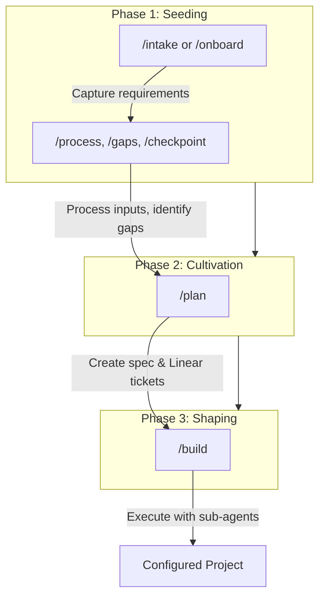

# Project Creator

**The challenge:** Setting up a Claude Code project well requires capturing tacit knowledge — requirements, constraints, architectural decisions, workflow patterns — that lives in your head. Without systematic extraction, projects start incomplete, context gets lost, and teams can't scale what individuals discover.

**The solution:** Project Creator uses reverse prompting to draw out your knowledge through structured conversation, then generates the Claude Code configuration artifacts: `CLAUDE.md`, `README.md`, skills, commands, and agents. You seed requirements, cultivate them into an implementation plan, then shape the final project — transforming ad-hoc setup into repeatable, scalable project creation.

---

## Prerequisites

### Required

- **Claude Code** — This project is designed to run inside Claude Code
- **Linear MCP** — The `/plan` and `/build` commands create and read tickets from Linear

### Linear Setup

Project Creator uses [Linear](https://linear.app) as the external memory for implementation plans. The Cultivation and Shaping phases require Linear MCP to be configured.

1. Install the Linear MCP server in your Claude Code configuration
2. Authenticate with your Linear workspace
3. Create a Linear project for tracking Project Creator work (or use an existing one)

Without Linear, you can still use the Seeding phase commands (`/intake`, `/onboard`, `/process`, `/gaps`, `/checkpoint`), but `/plan` and `/build` will not function.

---

## Workflow Overview



---

## Typical Workflow

```bash
# 1. Create or set project
/project new client/project-name

# 2. Seed: Capture requirements
/intake                    # Interactive requirements gathering
/process                   # Feed in existing documents
/gaps                      # Check what's missing

# 3. Cultivate: Plan the build
/plan                      # Creates spec + Linear tickets
# Review tickets in Linear, approve when ready

# 4. Shape: Build the project
/build                     # Executes tickets with sub-agents
```

---

## Quick Start

### Starting a New Project

```bash
# Point Claude Code at this directory
cd project-creator

# Create a new project
/project new acme-corp/api-service

# Start the intake conversation
/intake

# (Answer questions as Claude draws out your requirements)

# Check what's still needed
/gaps

# End your session
/checkpoint
```

### Onboarding an Existing Project

```bash
# Clone your existing project into projects/
git clone <repo-url> projects/acme-corp/existing-api

# Set it as current
/project acme-corp/existing-api

# Analyze and fill gaps
/onboard
```

### Continuing Work

```bash
# Set your project
/project acme-corp/api-service

# See where you left off
/gaps

# Continue capturing
/intake

# End session
/checkpoint
```

---

## The Three Phases

Project creation happens in phases:

| Phase | Focus | Commands |
|-------|-------|----------|
| **Seeding** | Capture requirements and context | `/intake`, `/onboard`, `/process`, `/gaps`, `/checkpoint` |
| **Cultivation** | Create implementation plan | `/plan` |
| **Shaping** | Execute plan with sub-agents | `/build` |

### Phase 1: Seeding

Capture enough context that a well-configured Claude Code project can be generated.

| Command | Purpose |
|---------|---------|
| `/intake` | New project reverse prompting |
| `/onboard` | Existing project analysis |
| `/process` | Handle external inputs (transcripts, docs) |
| `/gaps` | Assessment checkpoint |
| `/checkpoint` | Session capture |

### Phase 2: Cultivation

Consolidate requirements into an actionable implementation plan.

| Command | Purpose |
|---------|---------|
| `/plan` | Create implementation spec and Linear tickets |

`/plan` does the following:
- Creates implementation spec from captured requirements
- Creates Linear tickets with proper dependencies
- Creates structured `tickets.yaml` for build automation
- Requires user approval before proceeding to build

### Phase 3: Shaping

Execute the implementation plan with specialized sub-agents.

| Command | Purpose |
|---------|---------|
| `/build` | Execute implementation plan |

`/build` does the following:
- Reads tickets from `tickets.yaml`
- Uses `ticket-executor` agent (Opus) to implement each ticket
- Uses `ticket-verifier` agent (Sonnet) to verify completion
- Tracks progress in `build-progress.md`
- Recovers from interruptions automatically

---

## Agent Architecture

During `/build`, work is executed by specialized sub-agents:

| Agent | Role | Model |
|-------|------|-------|
| `ticket-executor` | Implements each ticket | Opus |
| `ticket-verifier` | Verifies completion independently | Sonnet |

This separation ensures:
- Fresh context per ticket (no degradation)
- Independent verification (no self-confirmation bias)
- Cost efficiency (Sonnet for verification)
- Clear failure attribution

---

## Commands Reference

### `/project` — Manage Project Context

| Usage | What It Does |
|-------|--------------|
| `/project` | Show current project and list all projects |
| `/project client/name` | Set current project (must exist) |
| `/project new client/name` | Create new project and set as current |

**Examples:**
```
/project                                    # What am I working on?
/project acme-corp/web-app                  # Switch to this project
/project new startup-inc/api-refactor       # Start a new project
```

### `/intake` — New Project Reverse Prompting

Starts a guided conversation to capture project requirements. Claude asks questions one at a time about:

- **Purpose** — What problem does this solve?
- **Users** — Who will use this?
- **Success criteria** — How will we know it works?
- **Constraints** — Technical, time, organizational limits
- **Context** — Related systems, prior art

Captured information is written to `[project]/context/` files.

### `/onboard` — Existing Project Analysis

For projects that already exist. Claude:

1. Analyzes what's there (CLAUDE.md, README, commands, etc.)
2. Reports what's FOUND vs MISSING
3. Asks before filling gaps
4. Uses reverse prompting to capture what's missing

**Prerequisite:** Clone/copy the project into `projects/[client]/[name]/` first.

### `/process` — Handle External Inputs

Feed in transcripts, documents, or notes. Claude extracts:

- Requirements mentioned
- Constraints identified
- Decisions implied
- Questions raised

Updates project context files with structured information.

**Usage:**
```
/process
(paste your transcript or notes)

/process path/to/document.md
```

### `/gaps` — Assessment

Checks captured context against what's needed for a complete project:

- Is the purpose clear?
- Are users identified?
- Are success criteria defined?
- Are constraints captured?
- Are key decisions documented?

Reports gaps with priorities and suggests what to capture next.

### `/checkpoint` — Session Capture

Run before ending a session. Claude:

1. Summarizes what was captured
2. Updates tracking files
3. Notes patterns discovered
4. Identifies next steps
5. Prepares handoff notes

### `/plan` — Create Implementation Plan

Consolidates seeding phase outputs into an actionable plan:

1. Reviews all context files (requirements, constraints, decisions)
2. Creates implementation specification
3. Generates Linear tickets with dependencies
4. Creates `tickets.yaml` for build automation
5. Presents plan for user approval

**Prerequisite:** Complete seeding phase first. Run `/gaps` to verify readiness.

### `/build` — Execute Implementation Plan

Executes the approved plan using sub-agents:

1. Reads tickets from `tickets.yaml`
2. For each ticket in dependency order:
   - Spawns `ticket-executor` (Opus) to implement
   - Spawns `ticket-verifier` (Sonnet) to verify
   - Updates `build-progress.md`
3. Handles failures with clear attribution
4. Recovers from interruptions automatically

**Prerequisite:** Run `/plan` first and approve the generated tickets.

---

## Directory Structure

```
project-creator/
├── CLAUDE.md                    # Configuration for Claude
├── README.md                    # This file
├── methodology.md               # Deep reference on reverse prompting
├── tracking/
│   ├── current-project.md       # Which project is active
│   ├── projects-log.md          # Registry of all projects
│   └── patterns-discovered.md   # Learnings for future use
├── .claude/
│   ├── commands/
│   │   ├── project.md
│   │   ├── intake.md
│   │   ├── onboard.md
│   │   ├── process.md
│   │   ├── gaps.md
│   │   ├── checkpoint.md
│   │   ├── plan.md              # Cultivation phase
│   │   └── build.md             # Shaping phase
│   └── agents/
│       ├── ticket-executor.md
│       └── ticket-verifier.md
├── templates/                   # Project templates (emerges over time)
├── docs/                        # Planning documents
└── projects/                    # Sub-projects (git-ignored)
    └── [client]/
        └── [project]/           # Each has its own git repo
```

### Sub-Project Structure

When you create a project, it gets:

```
projects/client/project/
├── .git/               # Independent git repo
└── context/
    ├── requirements.md # Captured requirements
    ├── constraints.md  # Technical and business constraints
    └── decisions.md    # Decisions made during intake
```

After `/plan`, the project also has:

```
projects/client/project/
├── implementation-spec.md  # Detailed implementation specification
└── tickets.yaml            # Structured tickets for /build
```

After `/build`, the project has full Claude Code configuration:

```
projects/client/project/
├── CLAUDE.md           # Project instructions
├── README.md           # Documentation
├── build-progress.md   # Build execution log
└── .claude/
    └── commands/       # Project-specific commands
```

---

## When to Use What

| Situation | Command |
|-----------|---------|
| Starting fresh with an idea | `/project new` then `/intake` |
| Have an existing codebase | Clone it, then `/onboard` |
| Have meeting notes or transcripts | `/process` |
| Want to see what's missing | `/gaps` |
| Ending a work session | `/checkpoint` |
| Switching between projects | `/project client/name` |
| Ready to plan implementation | `/plan` |
| Plan approved, ready to build | `/build` |

---

## Tips

1. **Answer naturally** — Don't try to structure your answers. Claude will extract and organize.

2. **It's okay to not know** — "I'm not sure yet" is a valid answer. It helps identify gaps.

3. **Use `/process` liberally** — Meeting transcripts, slack conversations, existing docs — feed them in.

4. **Run `/gaps` often** — It shows you where you are and what's next.

5. **Always `/checkpoint`** — Context can be lost. Checkpoints preserve progress.

6. **Projects evolve** — The first pass won't be perfect. That's expected.

7. **Review before `/build`** — Check the Linear tickets created by `/plan` before executing.

8. **`/build` is resumable** — If interrupted, just run `/build` again to continue where you left off.
