# Getting Up to Speed on GitHub

**A Practical Guide for Non-Technical Users**

**Version 1.0 | February 2026**

**Purpose**: This guide teaches you the minimal Git and GitHub knowledge needed to use Project Creator independently. You'll learn to clone repositories, make changes, commit your work, and collaborate—without needing to become a Git expert.

**Who this is for**: Non-technical professionals (product managers, executives, strategists) who need to manage project files and collaborate via GitHub.

**Time commitment**: 2-3 hours for initial setup and learning. Daily workflow takes 2-5 minutes once established.

---

## Table of Contents

1. [Understanding Git & GitHub (Concepts)](#part-1-understanding-git--github-concepts)
2. [Mac Terminal Basics](#part-2-mac-terminal-basics)
3. [Installation & Setup](#part-3-installation--setup)
4. [GitHub Account & Organization Setup](#part-4-github-account--organization-setup)
5. [SSH Keys (The Authentication Bridge)](#part-5-ssh-keys-the-authentication-bridge)
6. [Cloning Project Creator](#part-6-cloning-project-creator)
7. [Basic Git Hygiene](#part-7-basic-git-hygiene)
8. [Collaborator Management](#part-8-collaborator-management)
9. [Claude Code Integration](#part-9-claude-code-integration)
10. [Troubleshooting & Getting Help](#part-10-troubleshooting--getting-help)

**Appendices**:
- [A. Command Quick Reference](#appendix-a-command-quick-reference)
- [B. Glossary](#appendix-b-glossary)
- [C. Visual Workflow Diagrams](#appendix-c-visual-workflow-diagrams)
- [D. Further Resources](#appendix-d-further-resources)

---

## Part 1: Understanding Git & GitHub (Concepts)

Before diving into commands, let's build a mental model. Think of Git like organizing photo albums:

### The Photo Album Analogy

**Repository = Photo Album with History**
- A repository (or "repo") is like a photo album that tracks every version of every page
- You can flip back to see how things looked last week, last month, or last year
- Each page represents a snapshot in time

**Working Directory = Photos on Your Desk**
- When you open files on your computer, you're working with "photos on your desk"
- You can rearrange them, edit them, or add new ones
- Nothing is permanent until you decide to glue them into the album

**Staging Area = Photos Selected to Add**
- Before gluing photos to a page, you select which ones you want to include
- This is the "staging area"—it lets you organize what goes into the next snapshot
- You might have 10 changed files but only want to save 3 of them together

**Commit = Gluing Photos to a Page Permanently**
- A "commit" is when you permanently add your selected photos to the album
- You write a caption explaining what the page shows ("Family vacation, July 2025")
- Once committed, this snapshot is preserved in history forever

**Remote (GitHub) = Backup Album at Safe Location**
- GitHub is like storing a backup copy of your album at a secure facility
- If your house burns down (computer crashes), the album is safe
- Multiple people can access the same backup album to collaborate

**Push = Sending Your New Pages to the Backup**
- "Pushing" uploads your new commits (album pages) to GitHub
- Now everyone with access can see your latest changes

**Pull = Getting Someone Else's New Pages**
- "Pulling" downloads commits that others have made
- You're syncing your album with the latest version on GitHub

### Why This Matters

Understanding these concepts makes commands feel less mysterious:
- `git status` = "What photos are on my desk?"
- `git add file.md` = "Select this photo for the next page"
- `git commit -m "message"` = "Glue selected photos to a page with this caption"
- `git push` = "Send my new pages to the backup album"

**Key insight**: Git is about capturing snapshots of your work over time, not just syncing files like Dropbox. Every commit is a deliberate checkpoint you can return to.

---

## Part 2: Mac Terminal Basics

Git works through the command line (Terminal). Don't worry—you only need a handful of commands.

### Opening Terminal

1. Press `Cmd + Space` to open Spotlight
2. Type "Terminal"
3. Press `Enter`

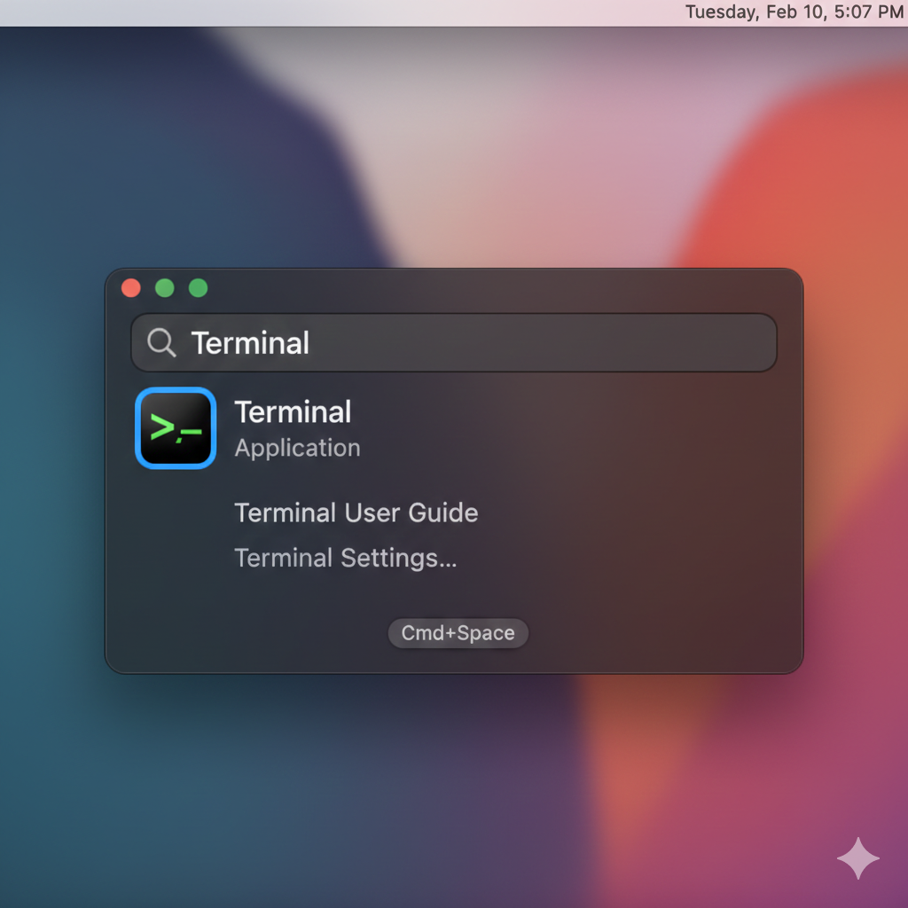

### Understanding the Terminal Window

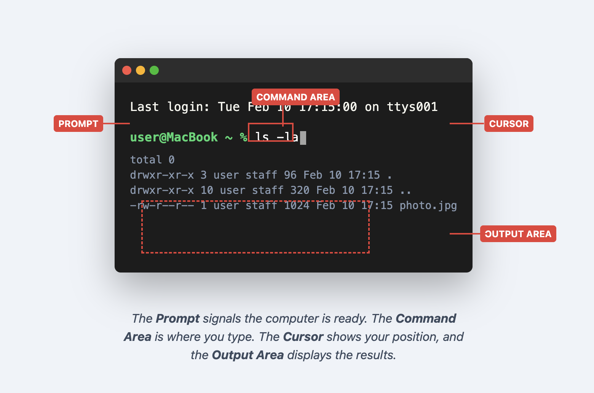

**Parts of the Terminal:**
- **Prompt**: Shows your username, computer name, and current directory (e.g., `username@Macbook ~ %`)
- **Command**: What you type (e.g., `git status`)
- **Output**: What the computer responds with
- **Cursor**: Blinking indicator showing where text will appear

### Copy-Paste Basics

- **Copy**: `Cmd + C` (in Terminal, use `Cmd + C` to copy selected text)
- **Paste**: `Cmd + V`
- **Tip**: You can copy commands from this guide and paste them directly into Terminal

### You Don't Need to Master Navigation

This guide uses **full paths** (complete addresses like `/Users/yourname/dev/project-creator`) so you don't need to learn complex directory navigation. We'll tell you exactly what to type.

---

## Part 3: Installation & Setup

### 3.1 Check If Git Is Already Installed

Open Terminal and type:

```bash
git --version
```

**If you see something like `git version 2.39.2`**: Git is installed! Skip to section 3.3.

**If you see `command not found`**: Git is not installed. Continue to 3.2.

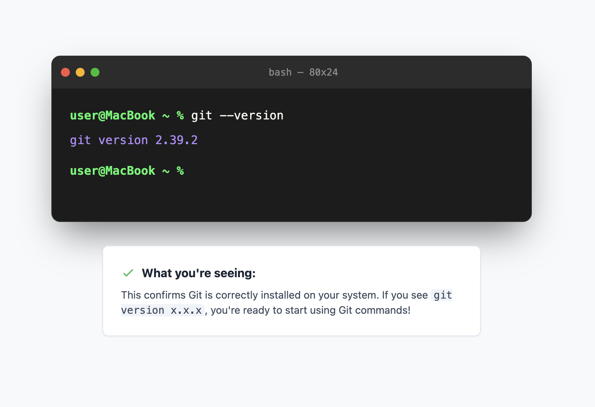
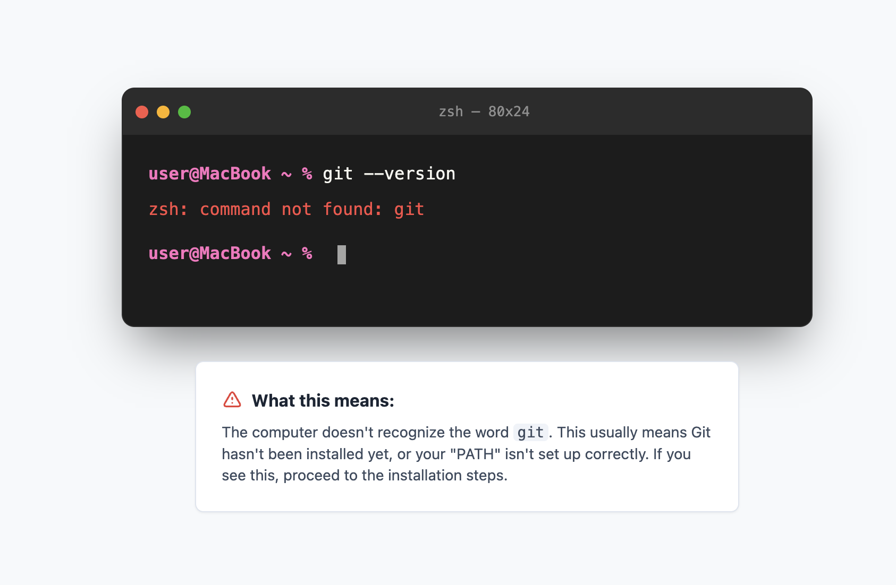

### 3.2 Install Git (Recommended: Xcode Command Line Tools)

The easiest way to install Git on Mac is through Apple's official developer tools:

```bash
xcode-select --install
```

**What happens**:
1. A dialog box appears asking if you want to install the tools
2. Click "Install"
3. Accept the license agreement
4. Wait 5-10 minutes for download and installation
5. When complete, run `git --version` to verify

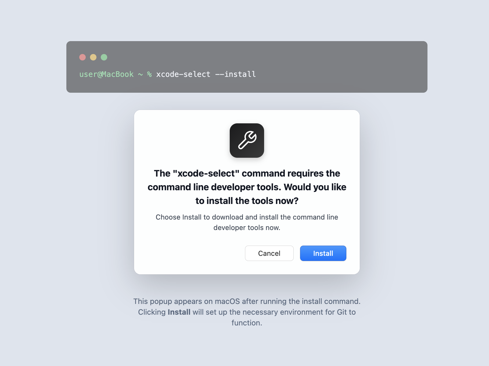

**Why this method?**
- Official Apple approach
- Includes other useful developer tools
- Auto-updates with macOS updates
- No manual downloads needed

**Common issues**:

| Problem | Solution |
|---------|----------|
| "Can't install the software because it is not currently available" | You may need to agree to Xcode license: `sudo xcodebuild -license` |
| Installation fails on older macOS | Download Git manually from [git-scm.com](https://git-scm.com/download/mac) |
| Already have Xcode installed | Git is already available; just verify with `git --version` |

### 3.3 Configure Git (Tell Git Who You Are)

Git needs to know your name and email for commit records. Run these commands (replace with your actual information):

```bash
git config --global user.name "Your Name"
git config --global user.email "your.email@example.com"
```

**Verify your configuration**:

```bash
git config --list
```

You should see:
```
user.name=Your Name
user.email=your.email@example.com
```


**Why this matters**: Every commit you make will be labeled with this name and email. Use your professional email and real name.

---

## Part 4: GitHub Account & Organization Setup

### 4.1 Create a GitHub Account

1. Go to [github.com](https://github.com)
2. Click "Sign up"
3. Choose a **professional username** (e.g., `jane-smith`, not `coolkid123`)
4. Use your **work email**
5. Create a strong password
6. Complete verification
7. **Enable two-factor authentication** (Settings → Password and authentication → Two-factor authentication)

**Why 2FA?** GitHub will require it for organizations soon. Enable it now to avoid access issues later.

### 4.2 Personal vs Organization Repositories

**Personal repositories**: Stored under your username (`github.com/jane-smith/my-project`)
- Good for: Individual experiments, personal notes
- Limitation: Tied to your account; access issues if you change roles

**Organization repositories**: Stored under organization name (`github.com/acme-corp/project-name`)
- Good for: Professional work, team collaboration, client projects
- Advantages:
  - Professional appearance
  - Survives personnel changes
  - Granular access control
  - Centralized billing

**For Project Creator work, always use organization repositories.**

### 4.3 Create a GitHub Organization

**Prerequisites**: You must have a GitHub account and be logged in.

**Steps**:

1. Click your profile picture (top-right corner)
2. Select "Your organizations"
3. Click "New organization"
4. Choose "Create a free organization"
5. **Organization name**: Choose carefully—this becomes part of all repository URLs
   - Good: `acme-corp`, `your-company`, `your-org-name`
   - Bad: `my-org`, `test-org-123`
6. **Contact email**: Your work email
7. **Organization belongs to**: "My personal account" (for now)
8. Click "Next"
9. **Add members** (optional now; we'll cover this in Part 8)
10. Click "Complete setup"


**Verification**: You should see your organization page at `github.com/[your-org-name]`

---

## Part 5: SSH Keys (The Authentication Bridge)

SSH keys let you securely communicate with GitHub without typing your password constantly.

### Why SSH Keys?

**The problem**: GitHub stopped accepting passwords for command-line operations in 2021.

**The solution**: SSH keys are like a secure handshake between your computer and GitHub:
- You generate a **key pair**: one private (stays on your Mac), one public (goes to GitHub)
- When you push/pull, GitHub verifies your identity using the key pair
- **One-time setup, automatic forever**

**Mac advantage**: macOS keychain integration means you won't type the passphrase repeatedly.

### 5.1 Generate an SSH Key

Open Terminal and run:

```bash
ssh-keygen -t ed25519 -C "your.email@example.com"
```

**Replace** `your.email@example.com` with your actual GitHub email.

**Prompts you'll see**:

```
Generating public/private ed25519 key pair.
Enter file in which to save the key (/Users/yourname/.ssh/id_ed25519):
```
**Just press Enter** (accept default location)

```
Enter passphrase (empty for no passphrase):
```
**Type a passphrase** (like a password for your key—choose something memorable but secure)

```
Enter same passphrase again:
```
**Type it again**

**What just happened**:
- Created `~/.ssh/id_ed25519` (private key—never share this)
- Created `~/.ssh/id_ed25519.pub` (public key—safe to share)

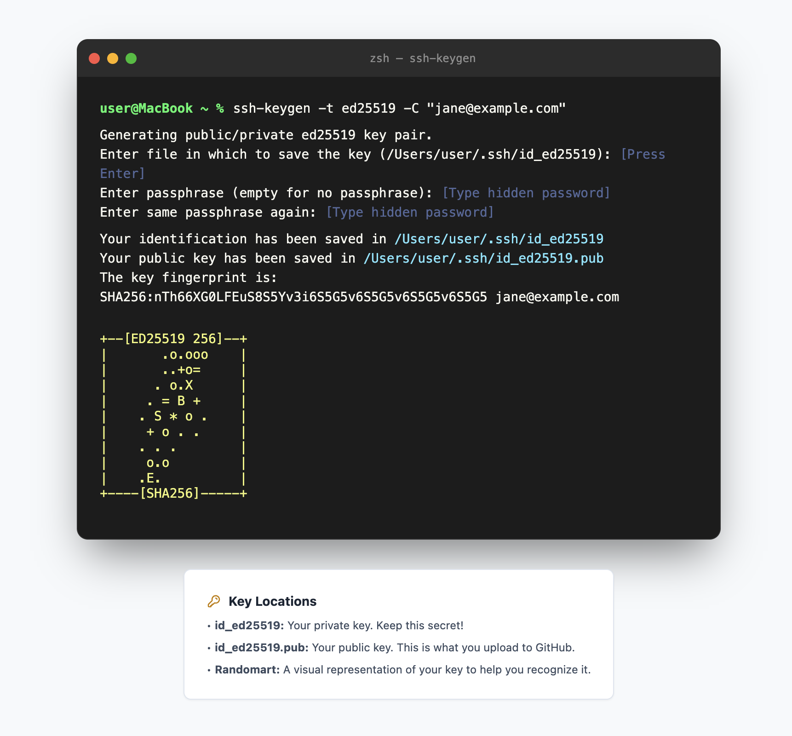

### 5.2 Add SSH Key to Mac Keychain

This stores your passphrase so you don't retype it constantly:

```bash
ssh-add --apple-use-keychain ~/.ssh/id_ed25519
```

**Make keychain integration permanent**: Create a config file:

```bash
cat >> ~/.ssh/config << 'EOF'
Host github.com
  AddKeysToAgent yes
  UseKeychain yes
  IdentityFile ~/.ssh/id_ed25519
EOF
```

**What this does**: Every time you interact with GitHub, your Mac automatically uses the keychain-stored passphrase.

### 5.3 Add Public Key to GitHub

Now we tell GitHub about your public key.

**Step 1: Copy your public key to clipboard**

```bash
cat ~/.ssh/id_ed25519.pub | pbcopy
```

(The public key is now copied—don't paste it anywhere yet!)

**Step 2: Add to GitHub**

1. Go to [github.com](https://github.com) and log in
2. Click your profile picture → "Settings"
3. In left sidebar, click "SSH and GPG keys"
4. Click "New SSH key"
5. **Title**: Something descriptive (e.g., "My MacBook Pro")
6. **Key type**: "Authentication Key"
7. **Key**: Paste (`Cmd + V`) your public key
8. Click "Add SSH key"
9. Confirm with your GitHub password if prompted

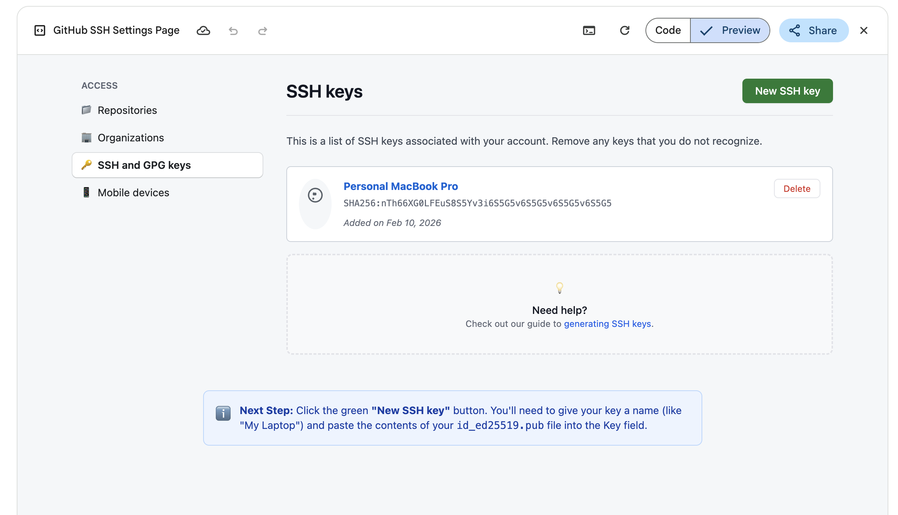

### 5.4 Test SSH Connection

Verify everything works:

```bash
ssh -T git@github.com
```

**First time**: You'll see a warning about authenticity. Type `yes` and press Enter.

**Success looks like**:
```
Hi yourname! You've successfully authenticated, but GitHub does not provide shell access.
```

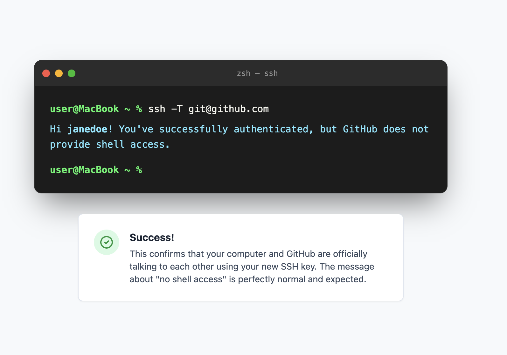

**Troubleshooting**:

| Error | Cause | Fix |
|-------|-------|-----|
| "Permission denied (publickey)" | Key not added to GitHub or wrong key | Repeat 5.3, verify key matches |
| "Could not resolve hostname" | No internet connection | Check WiFi |
| "Host key verification failed" | Corrupted known_hosts | Run `rm ~/.ssh/known_hosts` and retry |

---

## Part 6: Cloning Project Creator

Now you're ready to download (clone) the Project Creator repository.

### 6.1 Choose a Location

We recommend `~/dev/` for all development work:
- **Consistent**: Always know where projects live
- **Professional**: Industry standard
- **Simple**: Easy to remember and navigate

### 6.2 Clone the Repository

```bash
mkdir -p ~/dev
cd ~/dev
git clone git@github.com:Consortium-team/project-creator.git
```

**What each line does**:
1. `mkdir -p ~/dev` — Create the `dev` folder (if it doesn't exist)
2. `cd ~/dev` — Move into that folder
3. `git clone git@github.com:...` — Download Project Creator

**What you'll see**:
```
Cloning into 'project-creator'...
remote: Enumerating objects: 245, done.
remote: Counting objects: 100% (245/245), done.
remote: Compressing objects: 100% (178/178), done.
remote: Total 245 (delta 95), reused 180 (delta 45), pack-reused 0
Receiving objects: 100% (245/245), 89.34 KiB | 2.23 MiB/s, done.
Resolving deltas: 100% (95/95), done.
```

**Understanding the URL**:
- `git@github.com` — Protocol (SSH)
- `Consortium-team` — Organization name
- `project-creator.git` — Repository name

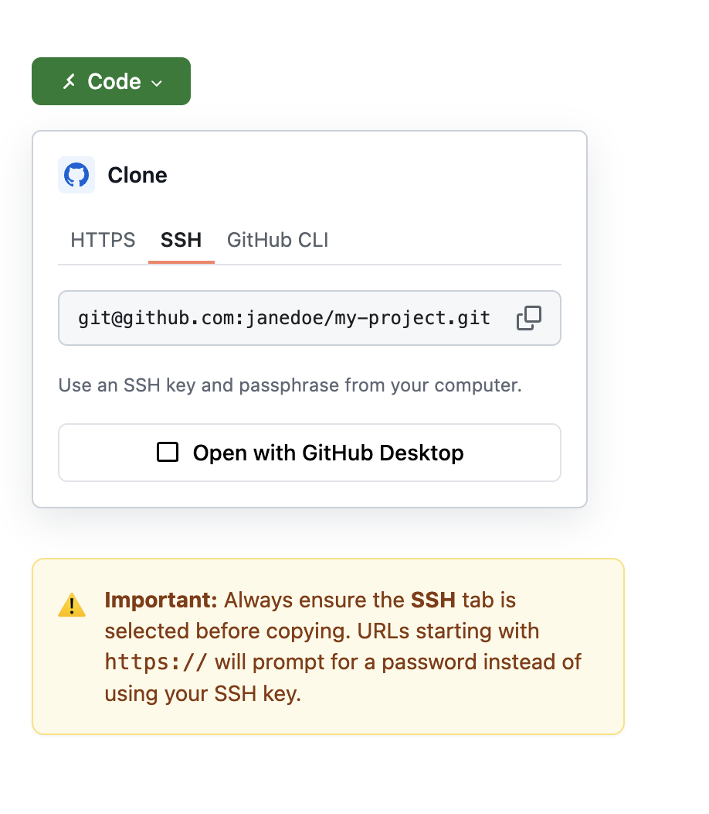

### 6.3 Verify the Clone

Check that files downloaded correctly:

```bash
ls ~/dev/project-creator
```

**You should see**:
```
CLAUDE.md          methodology.md     tracking/
README.md          project-types/     .claude/
.gitignore         templates/         projects/
```

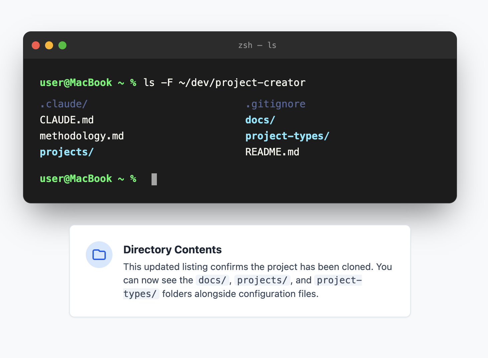

**Congratulations!** You now have a local copy of Project Creator.

---

## Part 7: Basic Git Hygiene

Daily Git workflow is simple once you understand the pattern.

### 7.1 When to Commit

Commit changes when:
- ✅ **End of work session** — Always commit before closing your computer
- ✅ **After logical chunk of work** — Completed a client profile, finished intake questions
- ✅ **Before risky changes** — About to try something experimental
- ✅ **Daily minimum** — Even if work isn't "done," commit progress

Don't wait for:
- ❌ "Perfect" work — Commits are checkpoints, not final versions
- ❌ "Complete" features — Incremental progress is good
- ❌ End of the week — Too infrequent; you'll forget what changed

### 7.2 Writing Good Commit Messages

A commit message should complete this sentence:
**"This commit will..."**

**Good examples**:
- ✅ "Add initial project profile for new client"
- ✅ "Update contact information and project terms"
- ✅ "Capture requirements from strategy session"
- ✅ "Fix typo in intake questions"

**Bad examples**:
- ❌ "Updated stuff" — Too vague; what stuff?
- ❌ "WIP" — Work-in-progress is obvious; say what the work IS
- ❌ "asdf" — Lazy; future you won't understand this
- ❌ "Fixed it" — Fixed what? How?

**Template**: `[Action] [What] [Optional context]`
- Action: Add, Update, Fix, Remove, Refactor, Document
- What: Be specific about files or features
- Context: Why, if not obvious

### 7.3 Daily Workflow (The Core Loop)

Navigate to your project:
```bash
cd ~/dev/project-creator
```

**Step 1: See what changed**
```bash
git status
```

Output shows:
- **Untracked files**: New files Git doesn't know about yet
- **Modified files**: Files you changed since last commit
- **Staged files**: Files selected for next commit

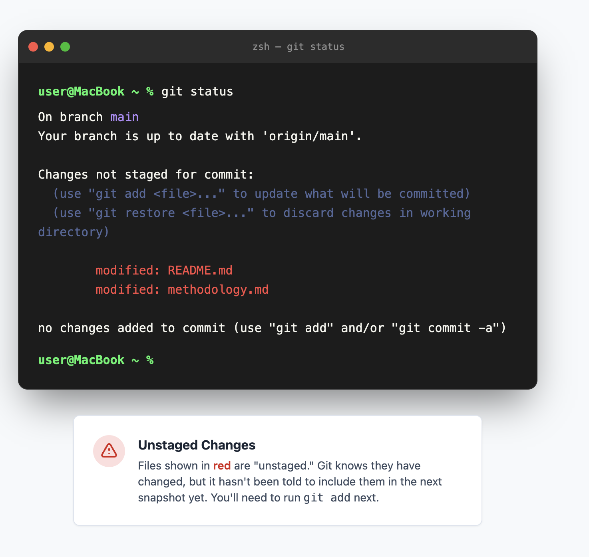

**Step 2: Review changes**
```bash
git diff
```

Shows line-by-line what changed (press `q` to exit).

**Step 3: Stage files for commit**

Option A: Stage specific file
```bash
git add projects/my-client/intake/requirements.md
```

Option B: Stage all changes
```bash
git add .
```

**After staging**:
```bash
git status
```

Files now appear under "Changes to be committed"

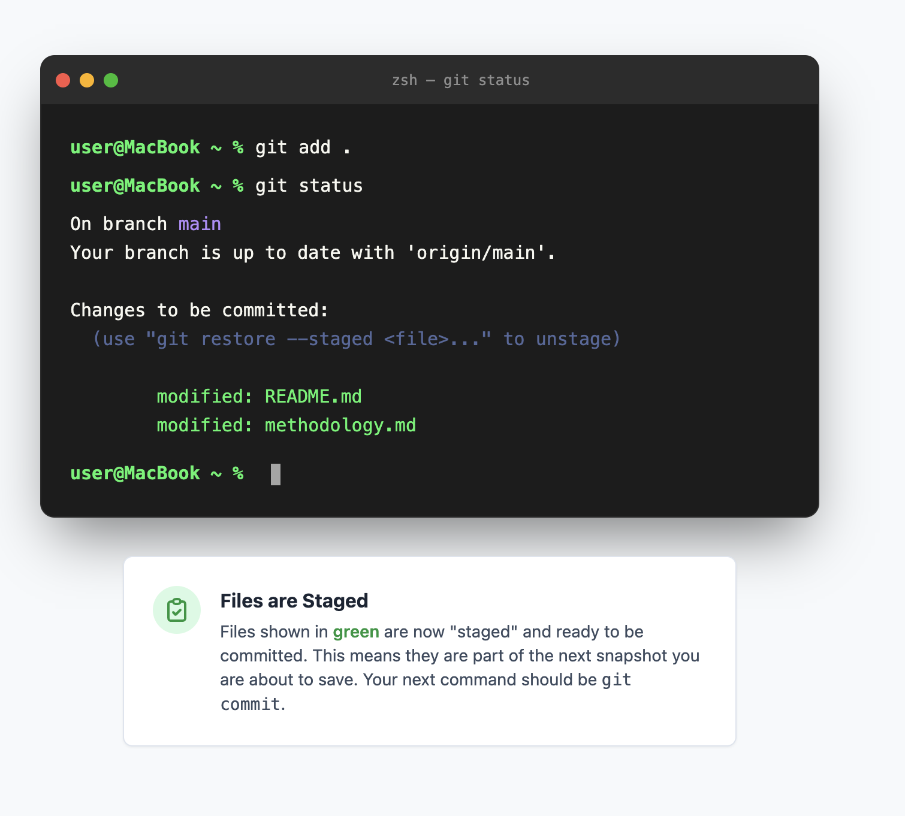

**Step 4: Commit staged changes**
```bash
git commit -m "Add initial requirements from client intake session"
```

**Success looks like**:
```
[main 3f8a2c1] Add initial requirements from client intake session
 1 file changed, 45 insertions(+)
 create mode 100644 projects/my-client/intake/requirements.md
```

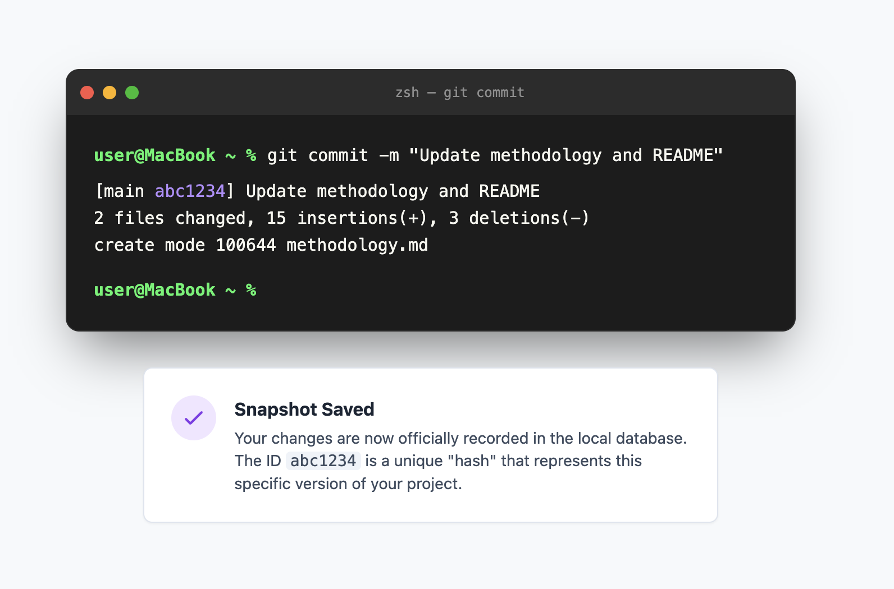

**Step 5: Push to GitHub**
```bash
git push
```

**What you'll see**:
```
Enumerating objects: 7, done.
Counting objects: 100% (7/7), done.
Delta compression using up to 8 threads
Compressing objects: 100% (4/4), done.
Writing objects: 100% (5/5), 1.23 KiB | 1.23 MiB/s, done.
Total 5 (delta 2), reused 0 (delta 0), pack-reused 0
To github.com:Consortium-team/project-creator.git
   a3f9d12..3f8a2c1  main -> main
```

**Verification**: Visit `github.com/[your-org]/[your-repo]` to see your commit listed.

### 7.4 Common Mistakes to Avoid

| Mistake | Why It's Bad | Better Practice |
|---------|--------------|-----------------|
| Lazy commit messages ("update", "fix") | Can't find changes later; unclear history | "Update client profile with new contact info" |
| Committing secrets (API keys, passwords) | Exposed publicly if repo is public; hard to remove from history | Use `.gitignore`, environment variables, or config files excluded from Git |
| Giant commits (50+ files changed) | Hard to review; difficult to revert if something breaks | Commit logical chunks (related changes together) |
| Not pulling before pushing | Creates merge conflicts | Always `git pull` before starting work |
| Working directly on `main` branch | Risky; mistakes affect everyone | Use branches for experiments (advanced topic) |

---

## Part 8: Collaborator Management

Once your organization and repository are set up, you can invite others to collaborate.

### 8.1 Permission Levels

GitHub has three main permission levels:

| Level | Can Do | Use For |
|-------|--------|---------|
| **Read** | View files, clone repository, create issues | Observers, clients reviewing work |
| **Write** | Read + push commits, create branches, manage issues | Collaborators actively working on project |
| **Admin** | Write + manage settings, add/remove collaborators, delete repository | Project owners, trusted leads |

**Start conservative**: Give "Write" access initially. Upgrade to "Admin" only when needed.

### 8.2 Add Collaborator to Repository

**Steps**:

1. Go to your repository on GitHub (`github.com/[org]/[repo]`)
2. Click "Settings" tab (top navigation)
3. In left sidebar, click "Collaborators and teams"
4. Click "Add people"
5. Enter collaborator's GitHub username or email
6. Select permission level (Read, Write, or Admin)
7. Click "Add [username] to this repository"

**They'll receive an email invitation**. Once accepted, they can clone and contribute.

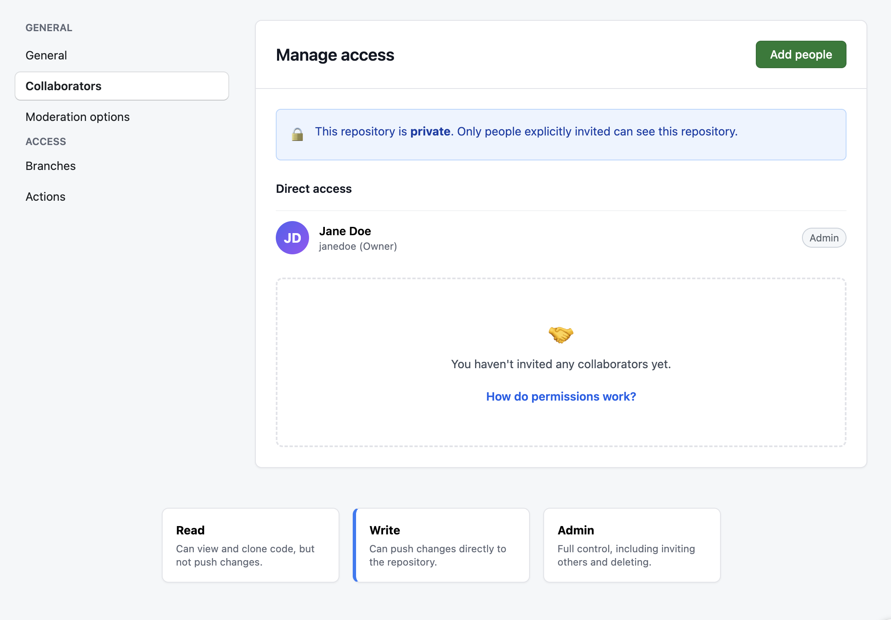

### 8.3 Add Collaborator to Organization

**For ongoing collaboration across multiple repositories**:

1. Go to your organization page (`github.com/[org]`)
2. Click "People" tab
3. Click "Invite member"
4. Enter their GitHub username or email
5. Choose role:
   - **Member**: Can see organization repos you grant access to
   - **Owner**: Full control (equivalent to Admin everywhere)
6. Click "Send invitation"

**Best practice**: Add as Member, then grant Write access per-repository.

### 8.4 Verify Collaborator Access

**Have the collaborator test**:

1. Accept invitation email
2. Visit repository on GitHub (should see it under "Your repositories")
3. Clone repository:
   ```bash
   git clone git@github.com:[org]/[repo].git
   ```
4. Make a test commit:
   ```bash
   cd [repo]
   echo "Test from [name]" >> test.md
   git add test.md
   git commit -m "Test commit to verify access"
   git push
   ```
5. Check GitHub to see their commit appear

**Troubleshooting**:

| Issue | Likely Cause | Fix |
|-------|--------------|-----|
| Can't see repository | Invitation not accepted | Check email spam; resend invitation |
| "Permission denied" on push | SSH key not set up | Follow Part 5 on their machine |
| Clone works but push fails | Read-only access | Upgrade to Write permissions |

---

## Part 9: Claude Code Integration

Claude Code can handle Git operations via natural language, reducing complexity.

### 9.1 When to Use Claude Code for Git

**Good use cases**:
- ✅ **Creating GitHub repositories** — "Create a private repository called 'my-project' in my organization"
- ✅ **Complex operations** — "Revert the last commit but keep my changes unstaged"
- ✅ **Commit message suggestions** — Claude can analyze your changes and suggest descriptive messages

**When to use manual Git (during learning phase)**:
- ✅ **Daily commits** — Practice makes permanent; build muscle memory
- ✅ **Understanding what happened** — Running commands yourself reveals how Git works
- ✅ **Debugging issues** — Easier to troubleshoot when you know what commands ran

**After 2-3 weeks of manual practice**, shift to Claude Code for routine operations.

### 9.2 Creating a Remote Repository via Claude Code

Open Claude Code in your project directory:

```bash
cd ~/dev/project-creator/projects/my-client/my-project
claude
```

**Prompt Claude**:

```
Create a private GitHub repository called 'my-project'
in my organization and push my work to it.
```

Claude will:
1. Use `gh` (GitHub CLI) or API to create the repository
2. Add the remote to your local Git configuration
3. Push your commits

**Verify**: Visit `github.com/[your-org]/my-project` to see your repository.

### 9.3 Commit Message Suggestions

**Instead of manually writing commit messages**:

```bash
cd ~/dev/project-creator/projects/my-client/my-project
git add .
claude
```

**Prompt**:
```
Review my staged changes and suggest a descriptive commit message.
```

Claude analyzes your diffs and suggests something like:
```
"Add user authentication flow with JWT tokens and password reset"
```

**If you approve**:
```bash
git commit -m "Add user authentication flow with JWT tokens and password reset"
git push
```

### 9.4 Automating Routine Git Tasks

**Example Claude Code prompts**:

- "Commit all my changes with an appropriate message and push to GitHub"
- "Show me what I changed today"
- "Create a new branch called 'feature/new-intake-questions'"
- "Merge my feature branch into main"

**Remember**: Claude Code executes Git commands on your behalf. You can always ask "What Git commands would you run for this?" to learn the underlying mechanics.

---

## Part 10: Troubleshooting & Getting Help

### 10.1 Common Errors & Fixes

| Error Message | What It Means | How to Check | How to Fix |
|---------------|---------------|--------------|------------|
| **"fatal: not a git repository"** | You're not inside a cloned repository | `pwd` (print working directory) | `cd ~/dev/project-creator` to navigate to repo |
| **"Permission denied (publickey)"** | SSH key not recognized by GitHub | `ssh -T git@github.com` | Re-add public key to GitHub (Part 5.3) |
| **"refusing to merge unrelated histories"** | Your local and remote repos have different starting points | `git log` to see commits | Usually safe: `git pull --allow-unrelated-histories` |
| **"Your branch is behind 'origin/main'"** | Someone else pushed changes you don't have yet | `git status` | `git pull` to download their changes |
| **"Your branch is ahead of 'origin/main'"** | You have commits not yet pushed | `git status` | `git push` to upload your changes |
| **"Merge conflict in [file]"** | You and someone else changed the same lines | `git status` shows conflicted files | Edit files to resolve conflicts, then `git add` and `git commit` |
| **"fatal: remote origin already exists"** | Trying to add remote that's already configured | `git remote -v` to see remotes | Use `git remote set-url origin [new-url]` if changing |
| **"Nothing to commit, working tree clean"** | No changes since last commit (not an error!) | `git status` | Continue working; this is normal |

### 10.2 How to Ask for Help Effectively

**When you encounter an issue, provide**:

1. **What you were trying to do** — "I was trying to push my commits to GitHub"
2. **The exact command you ran** — `git push origin main`
3. **The complete error message** — Copy entire output from Terminal
4. **What you've tried** — "I verified SSH key is added to GitHub"
5. **Output of `git status`** — Shows current state

**Example help request**:

```
I'm trying to push my commits but getting an error.

Command I ran:
git push

Error message:
fatal: The current branch main has no upstream branch.
To push the current branch and set the remote as upstream, use
    git push --set-upstream origin main

What I've tried:
- Verified I'm in the correct directory (~/dev/project-creator)
- Checked that GitHub repository exists

Output of git status:
On branch main
Your branch is ahead of 'origin/main' by 2 commits.
  (use "git push" to publish your local commits)
nothing to commit, working tree clean
```

**This gives helpers everything needed to diagnose the problem.**

### 10.3 Self-Help Strategies

**Before asking for help**:

1. **Read the error message carefully** — Git often suggests the fix
   - Example: "use `git push --set-upstream origin main`" → Try that command

2. **Check Git status** — `git status` reveals 80% of issues
   - Shows what branch you're on
   - Lists changed files
   - Indicates if you're ahead/behind remote

3. **Verify basic assumptions**:
   ```bash
   pwd                    # Am I in the right directory?
   git remote -v          # Is my remote configured?
   ssh -T git@github.com  # Does SSH work?
   ```

4. **Google the exact error** — Add "git" + your error message
   - Likely someone else solved this on Stack Overflow

5. **Ask Claude Code** — Paste error into Claude and ask for interpretation

### 10.4 Quick Reference Card

Print or bookmark this:

| Task | Command |
|------|---------|
| **See what changed** | `git status` |
| **Review line-by-line changes** | `git diff` |
| **Stage specific file** | `git add file.md` |
| **Stage all changes** | `git add .` |
| **Commit with message** | `git commit -m "Your message"` |
| **Push to GitHub** | `git push` |
| **Pull latest changes** | `git pull` |
| **See commit history** | `git log` |
| **See remotes** | `git remote -v` |
| **Clone repository** | `git clone git@github.com:org/repo.git` |
| **Check Git version** | `git --version` |
| **Test SSH to GitHub** | `ssh -T git@github.com` |

**Daily workflow (most common)**:
```bash
cd ~/dev/project-creator     # Navigate to repository
git status                   # See what changed
git add .                    # Stage all changes
git commit -m "Description"  # Commit with message
git push                     # Upload to GitHub
```

### 10.5 Further Learning

**Once you're comfortable with basics**:

- **Branches** — Isolate experimental work from main code
- **Pull Requests** — Formal review process before merging
- **`.gitignore`** — Exclude files from Git tracking
- **Merge conflicts** — Resolving when two people change the same lines
- **Reverting commits** — Undoing mistakes safely

**Resources**:
- [GitHub's Git Handbook](https://guides.github.com/introduction/git-handbook/) — Comprehensive guide
- [Oh Shit, Git!?!](https://ohshitgit.com/) — Fixes for common mistakes (humorous but practical)
- [Visual Git Reference](https://marklodato.github.io/visual-git-guide/index-en.html) — Diagrams of Git operations

**Claude Code as tutor**: Ask Claude to explain any Git concept or command in plain language.

---

## Appendix A: Command Quick Reference

### Essential Daily Commands

```bash
# Navigation
cd ~/dev/project-creator          # Go to project directory
pwd                                # Print current directory

# Checking status
git status                         # What files changed?
git diff                           # Line-by-line changes
git log                            # Commit history

# Staging and committing
git add file.md                    # Stage specific file
git add .                          # Stage all changes
git commit -m "Message"            # Commit staged files

# Syncing with GitHub
git pull                           # Download latest changes
git push                           # Upload your commits

# SSH verification
ssh -T git@github.com              # Test GitHub connection
```

### Setup Commands (One-Time)

```bash
# Install Git (via Xcode tools)
xcode-select --install

# Configure Git
git config --global user.name "Your Name"
git config --global user.email "your.email@example.com"

# Generate SSH key
ssh-keygen -t ed25519 -C "your.email@example.com"

# Add SSH key to keychain
ssh-add --apple-use-keychain ~/.ssh/id_ed25519

# Copy public key to clipboard
cat ~/.ssh/id_ed25519.pub | pbcopy

# Clone repository
git clone git@github.com:org/repo.git
```

### Troubleshooting Commands

```bash
# Check configuration
git config --list
git remote -v

# See more details
git status -v
git log --oneline --graph --all

# Undo (use carefully)
git reset HEAD file.md             # Unstage file (keep changes)
git checkout -- file.md            # Discard changes to file
git revert HEAD                    # Undo last commit (safe)
```

---

## Appendix B: Glossary

**Branch**: An independent line of development. `main` is the default branch.

**Clone**: Download a complete copy of a repository from GitHub to your computer.

**Commit**: A snapshot of your project at a specific point in time. Includes changes and a message.

**Diff**: The differences between two versions of a file (what changed).

**Fork**: A personal copy of someone else's repository on GitHub (for contributing to open source).

**Hash**: A unique identifier for each commit (e.g., `3f8a2c1`).

**HEAD**: A pointer to the current commit you're working from.

**Local**: On your computer (as opposed to remote/GitHub).

**Merge**: Combining changes from different branches or commits.

**Origin**: The default name for the remote repository on GitHub.

**Pull**: Download commits from GitHub and merge them into your local branch.

**Pull Request (PR)**: A request to merge your changes into someone else's repository (formal review process).

**Push**: Upload your local commits to GitHub.

**Remote**: A repository hosted on GitHub (or other server).

**Repository (Repo)**: A project folder tracked by Git, including all history.

**Staging Area**: Where you prepare files before committing (the "selected photos" in our analogy).

**SSH Key**: A secure credential pair (public + private) for authenticating with GitHub without passwords.

**Upstream**: The original repository you forked from (advanced concept).

**Working Directory**: The current state of files on your computer (not yet committed).

---

## Appendix C: Visual Workflow Diagrams

### Basic Workflow: Edit → Stage → Commit → Push

```
┌─────────────────┐
│  Working        │  (Files on your computer)
│  Directory      │  git status shows "modified"
└────────┬────────┘
         │ git add file.md
         ▼
┌─────────────────┐
│  Staging        │  (Selected for next commit)
│  Area           │  git status shows "to be committed"
└────────┬────────┘
         │ git commit -m "message"
         ▼
┌─────────────────┐
│  Local          │  (Committed to history)
│  Repository     │  git log shows commit
└────────┬────────┘
         │ git push
         ▼
┌─────────────────┐
│  Remote         │  (Uploaded to GitHub)
│  (GitHub)       │  Visible on github.com
└─────────────────┘
```

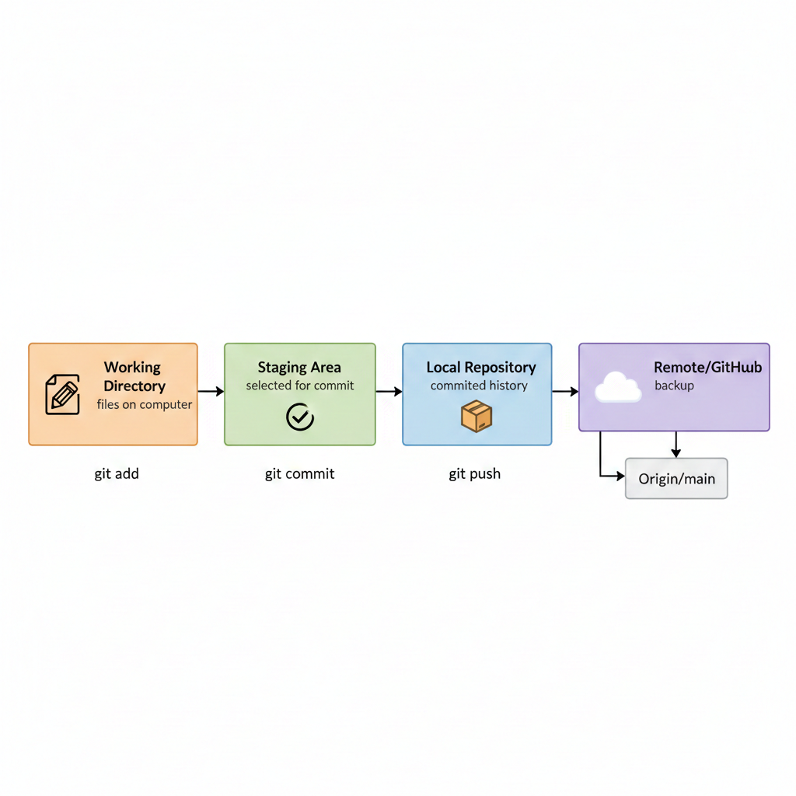

### Git and GitHub Relationship

```
┌────────────────────────────────────────┐
│         Your Computer (Local)          │
│                                        │
│  ┌──────────────────────────────────┐ │
│  │      Working Directory           │ │
│  │  (Files you edit)                │ │
│  └──────────────────────────────────┘ │
│                 │                      │
│                 ▼                      │
│  ┌──────────────────────────────────┐ │
│  │      Git Repository              │ │
│  │  (.git folder with history)      │ │
│  └──────────────────────────────────┘ │
│                 │                      │
└─────────────────┼──────────────────────┘
                  │
                  │ git push / git pull
                  ▼
┌─────────────────────────────────────────┐
│         GitHub (Remote)                 │
│                                         │
│  ┌──────────────────────────────────┐  │
│  │      Remote Repository           │  │
│  │  (Backup + collaboration)        │  │
│  └──────────────────────────────────┘  │
└─────────────────────────────────────────┘
```

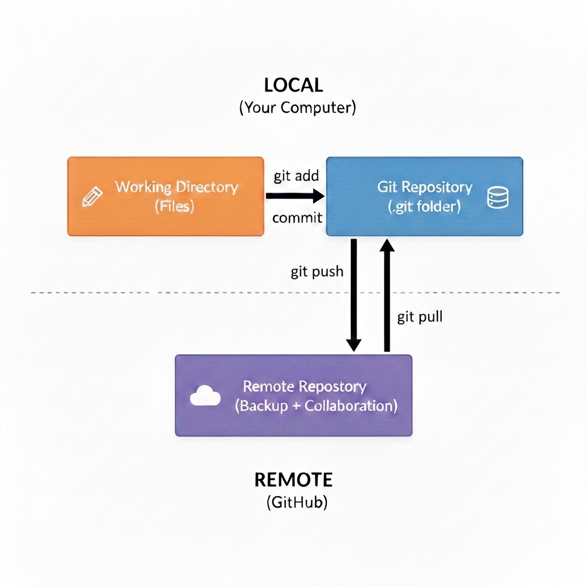

### Photo Album Analogy (Visual)

```
┌─────────────────────────────────────────────┐
│  Photos scattered on desk                   │  ← Working Directory
│  (your files being edited)                  │
│  📷 profile.md   📷 todo.md   📷 notes.md   │
└─────────────┬───────────────────────────────┘
              │
              │ git add (select photos)
              ▼
┌─────────────────────────────────────────────┐
│  Photos selected for album page             │  ← Staging Area
│  ✅ profile.md   ✅ todo.md                 │
└─────────────┬───────────────────────────────┘
              │
              │ git commit (glue to page)
              ▼
┌─────────────────────────────────────────────┐
│  Page in album with caption                 │  ← Local Repository
│  "Feb 10, 2026: Updated project files"      │
│  📖 [profile.md, todo.md]                   │
└─────────────┬───────────────────────────────┘
              │
              │ git push (send to backup)
              ▼
┌─────────────────────────────────────────────┐
│  Backup album at safe location              │  ← GitHub
│  🏛️ github.com/yourorg/yourrepo             │
└─────────────────────────────────────────────┘
```

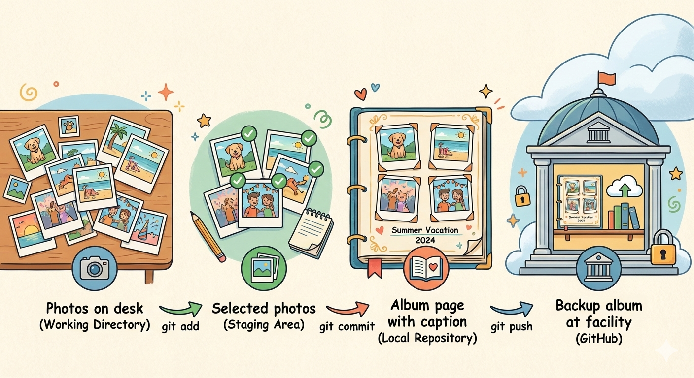

---

## Appendix D: Further Resources

### Official Documentation

- [Git Documentation](https://git-scm.com/doc) — Comprehensive reference
- [GitHub Guides](https://guides.github.com/) — Tutorials for all skill levels
- [GitHub CLI Manual](https://cli.github.com/manual/) — For `gh` command

### Interactive Learning

- [Learn Git Branching](https://learngitbranching.js.org/) — Visual, interactive tutorial
- [GitHub Skills](https://skills.github.com/) — Hands-on courses in real repositories
- [Git Immersion](http://gitimmersion.com/) — Step-by-step lab exercises

### Quick References

- [Git Cheat Sheet (GitHub)](https://education.github.com/git-cheat-sheet-education.pdf) — PDF summary
- [Visual Git Cheat Sheet](https://ndpsoftware.com/git-cheatsheet.html) — Interactive visualization
- [Oh Shit, Git!?!](https://ohshitgit.com/) — Fixes for common mistakes

### Video Tutorials

- [Git & GitHub for Beginners (FreeCodeCamp)](https://www.youtube.com/watch?v=RGOj5yH7evk) — Comprehensive 1-hour video
- [GitHub Training & Guides (YouTube)](https://www.youtube.com/githubguides) — Short, focused videos

### Books

- *Pro Git* by Scott Chacon (free online: [git-scm.com/book](https://git-scm.com/book)) — Definitive guide
- *Git Pocket Guide* by Richard Silverman — Quick reference for daily use

### Community Support

- [Stack Overflow: Git Questions](https://stackoverflow.com/questions/tagged/git) — Search before asking; likely already answered
- [GitHub Community Forum](https://github.community/) — Official support forum
- [r/git (Reddit)](https://www.reddit.com/r/git/) — Friendly community for questions

### Tools to Explore Later

- [GitHub Desktop](https://desktop.github.com/) — Graphical interface (alternative to command line)
- [GitKraken](https://www.gitkraken.com/) — Advanced visual Git client
- [SourceTree](https://www.sourcetreeapp.com/) — Free Git GUI for Mac

---

## Conclusion

**You now have everything you need to**:
- ✅ Install and configure Git
- ✅ Set up GitHub authentication via SSH
- ✅ Clone repositories
- ✅ Make commits with descriptive messages
- ✅ Push your work to GitHub
- ✅ Manage collaborators
- ✅ Integrate with Claude Code for automation

**Next steps**:
1. Follow Part 3 to install Git (if needed)
2. Complete Part 5 to set up SSH keys
3. Clone Project Creator (Part 6)
4. Practice daily workflow (Part 7) for 2-3 weeks to build muscle memory
5. Gradually shift routine tasks to Claude Code (Part 9)

**Remember**: Git has a learning curve, but the core daily workflow is just:
```bash
git status → git add . → git commit -m "message" → git push
```

Everything else builds on this foundation.

**Questions?** Use Part 10's troubleshooting guide, or ask Claude Code for help.

---

**Version**: 1.0
**Last Updated**: February 10, 2026
**Part of**: [Project Creator](https://github.com/Consortium-team/project-creator)
**Originally created for**: Consortium.team clients; contributed as open-source resource

**License**: MIT License — Free to use, modify, and distribute. See [Project Creator LICENSE](../../../LICENSE) for details.

## Updates This Guide

Found an error or have a suggestion? Contributions welcome!

1. **Report issues**: Create an issue in the [Project Creator repository](https://github.com/Consortium-team/project-creator/issues)
2. **Suggest improvements**: Submit a pull request with your changes
3. **After updating Markdown**: Run `./generate-pdf.sh` to regenerate the PDF before committing

**Maintenance**: This guide is reviewed quarterly for GitHub UI changes, macOS updates, and Git version changes.
